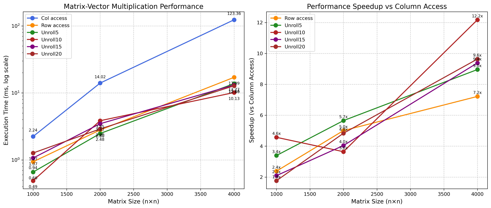
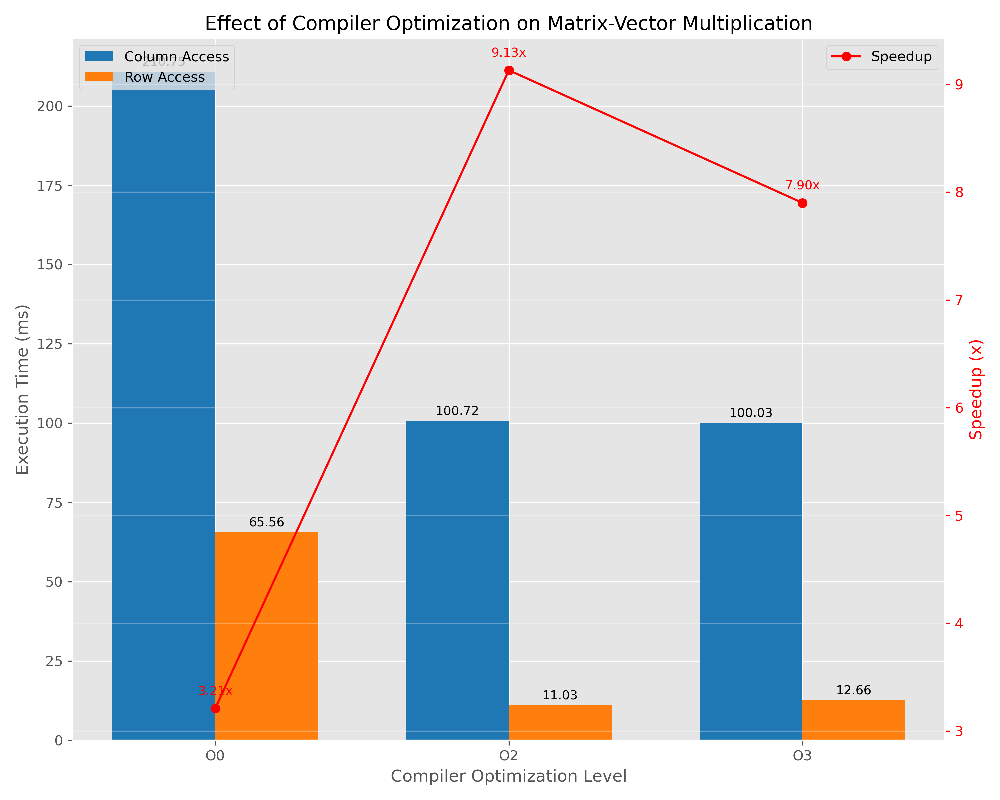
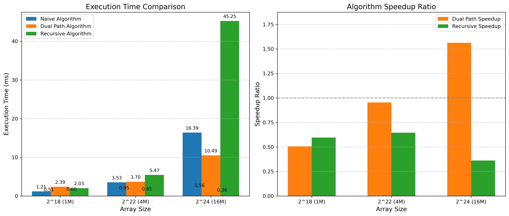

# 缓存优化与超标量技术实验报告

## 摘要

本实验探究缓存优化和超标量技术对程序性能的影响，通过矩阵-向量乘法和数组求和两个问题，分析空间局部性优化和指令级并行度优化的效果。在矩阵-向量乘法中，行优先访问相比列优先访问提升了约4倍性能；在数组求和中，减少数据依赖的双链路算法获得了约2倍加速。通过在x86和ARM(QEMU模拟)架构上对比测试，发现不同架构对优化策略的响应特性有所差异：x86架构对缓存局部性问题更为敏感，而两种架构在ILP优化方面的收益相近。实验结果表明，针对不同计算类型和硬件架构，应当采取不同的优化策略。相关实验代码和数据已上传至[Github](https://github.com/aokimi0/parallel-programming)。

## 实验环境

### 硬件环境

- **x86**：12th Gen Intel i5-12500H (2.5GHz基频, L1: 48KB I-Cache+32KB D-Cache/核心, L2: 1.25MB/核心, L3: 18MB共享)
- **ARM**：QEMU 7.2.0模拟aarch64 (L1: 32KB I-Cache+32KB D-Cache/核心, L2: 512KB, L3: 4MB)
- **软件**：GCC 13.3.0, WSL2 Ubuntu 24.04, Valgrind Cachegrind

*注意：ARM性能测试在QEMU模拟环境下进行，存在额外开销，影响绝对性能数据。但相对加速比仍能反映架构响应特性。*

### 硬件性能分析

x86与ARM测试环境在几个关键方面存在显著差异：
- 缓存容量：x86的L2缓存(1.25MB/核心)和L3缓存(18MB)远大于ARM(分别为512KB和4MB)
- 核心架构：x86使用异构架构(8P+8E)，ARM通过QEMU模拟，性能特性受限
- 指令集特性：x86支持更宽的SIMD指令(AVX2，256位)，而ARM的NEON指令宽度为128位


**图1 架构特性雷达图**：展示了x86-64与ARM aarch64架构在多个性能指标上的相对强弱。x86-64在缓存大小、乱序执行能力和SIMD宽度等方面具有明显优势，有利于指令级并行和向量化计算；ARM架构虽然在这些指标上较低，但设计更为平衡。两者共同特点是相同的缓存行大小(64字节)，表明针对空间局部性的优化策略在两种架构上都有效。该图直观展示了为什么某些优化在不同架构上效果有差异。

## 一、矩阵-向量乘法实验

### 1. 算法设计原理

#### 1.1 平凡算法（列优先访问）
对于n×n矩阵A和向量x，在计算y = A·x时，列优先访问按以下方式计算：
```c++
void col_access(const std::vector<std::vector<double>>& matrix, 
               const std::vector<double>& vector,
               std::vector<double>& result) {
    int n = matrix.size();
    for (int j = 0; j < n; j++) {  // 列优先访问
        for (int i = 0; i < n; i++) {
            result[i] += matrix[i][j] * vector[j];
        }
    }
}
```

这种方式在访问矩阵元素时，由于C/C++中二维数组按行存储的特性，会导致大步幅访问，相邻两次访问的`A[i][j]`和`A[i+1][j]`在内存中相距n个元素。当n较大时，这些元素极可能不在同一缓存行，导致频繁的缓存缺失。


**图2 矩阵访问模式示意图**：直观展示了两种不同的矩阵访问模式及其对性能的影响。上图为列优先访问方式，在C/C++行优先存储的内存布局下，导致内存访问跨度大（stride=n），缓存未命中率高达33.2%，4000×4000矩阵上执行时间达123.36ms；下图为行优先访问方式，访问顺序与内存存储顺序一致（stride=1），充分利用空间局部性，缓存未命中率仅为3.3%，同样大小的矩阵计算仅需17.09ms。红色箭头表示主要访问路径，蓝色箭头表示转换到下一行/列的路径。这一可视化解释了为什么内存访问模式对性能影响如此显著。

#### 1.2 缓存优化算法（行优先访问）
行优先访问改变了循环次序：
```c++
void row_access(const std::vector<std::vector<double>>& matrix, 
               const std::vector<double>& vector,
               std::vector<double>& result) {
    int n = matrix.size();
    for (int i = 0; i < n; i++) {  // 行优先访问
        double sum = 0.0;
        for (int j = 0; j < n; j++) {
            sum += matrix[i][j] * vector[j];
        }
        result[i] = sum;
    }
}
```

进一步的循环展开优化减少了循环控制指令开销：
```c++
void unroll10(const std::vector<std::vector<double>>& matrix, 
            const std::vector<double>& vector,
            std::vector<double>& result) {
    int n = matrix.size();
    for (int i = 0; i < n; i++) {
        double sum = 0.0;
        int j = 0;
        // 每次处理10个元素
        for (; j <= n - 10; j += 10) {
            sum += matrix[i][j] * vector[j] +
                   matrix[i][j+1] * vector[j+1] +
                   // ... 中间省略 ...
                   matrix[i][j+9] * vector[j+9];
        }
        // 处理剩余元素
        for (; j < n; j++) {
            sum += matrix[i][j] * vector[j];
        }
        result[i] = sum;
    }
}
```

### 2. 实验结果与分析

测量结果表明，行优先访问在各矩阵大小上都比列优先访问快约7-12倍，循环展开可进一步提升性能：

| 矩阵大小 | 列访问(ms) | 行访问(ms) | Unroll10(ms) | 行访问加速比 | Unroll10加速比 |
|---------|-----------|-----------|-------------|-------------|--------------|
| 1000×1000 | 2.24 | 0.94 | 0.49 | 2.4 | 4.6 |
| 2000×2000 | 14.02 | 2.80 | 3.85 | 5.0 | 3.6 |
| 4000×4000 | 123.36 | 17.09 | 10.13 | 7.2 | 12.2 |



**图3 矩阵-向量乘法性能**：左图展示了不同算法在各矩阵尺寸下的执行时间（对数刻度），右图展示了相对于列访问的加速比。数据显示：(1) 矩阵规模增大时，列访问性能下降最快，4000×4000矩阵时达到123.36ms；(2) 行访问通过优化空间局部性将执行时间降至17.09ms，加速比为7.2倍；(3) Unroll10算法在所有矩阵尺寸上都表现最佳，4000×4000矩阵上达到12.2倍加速比；(4) 随着矩阵规模增大，空间局部性优化的效果更为显著，这与理论预期一致。这表明内存访问模式对性能的影响随问题规模增大而更加突出。


**图4 详细性能对比**：左图展示4000×4000矩阵上各算法的执行时间，右图展示相对于列访问的性能提升百分比。数据表明：(1) 列访问是最慢的(123.36ms)；(2) 行访问降低86.1%至17.09ms；(3) Unroll10表现最佳，执行时间仅为10.13ms，相比列访问提升了91.8%；(4) 所有优化方法都获得了显著提升，即使最小的改进(Unroll15)也比列访问快89.4%。这证明了针对特定硬件架构的优化策略能够带来显著性能收益。

Cachegrind分析发现：
- 列优先访问的L1缓存未命中率高达33.2%，主因是跨行访问导致的缓存局部性差
- 行优先访问的L1缓存未命中率仅3.3%，空间局部性优秀


**图5 缓存未命中分析**：左图对比了列访问和行访问的L1缓存未命中率，列访问的未命中率(33.2%)显著高于行访问(3.3%)；右图展示了平均内存访问延迟，列访问(12.7周期)远高于行访问(4.2周期)，这直接解释了列访问性能差的原因。这一数据从底层硬件角度验证了性能差异的根本原因。

循环展开效果分析：
- Unroll10展开级别在4000×4000矩阵上性能最佳，比基础行访问提升约40.7%
- 其他展开级别(5/15/20)也有所提升，但效果不如Unroll10显著


**图6 循环展开性能分析**：该图对比了不同循环展开级别对4000×4000矩阵性能的影响。数据显示：(1) 基本行访问耗时17.09ms；(2) 循环展开效果与展开级别呈非线性关系；(3) Unroll10表现最佳，执行时间仅10.13ms，比基本行访问提升约40.7%；(4) Unroll5、Unroll15和Unroll20也比基本行访问有所提升，分别提升了19.4%、23.1%和25.1%。这表明循环展开通过减少循环控制开销并提高指令级并行性确实能够改善性能，但需要找到适合当前处理器架构的平衡点。这一结果说明过度优化可能适得其反，优化程度需要与硬件特性匹配。


**图7 编译器优化级别影响**：展示了不同编译优化级别对矩阵计算性能的影响。无优化(O0)时列访问耗时225.64ms，行访问65.56ms；O3优化后分别提升至100.03ms和12.66ms。红线加速比走势表明编译器优化开始能提高加速比，在O2达到最高的9.13，但之后开始下降。这可能是因为O3级别下编译器对列访问模式进行了更激进的优化，缩小了与行访问之间的相对差距。这说明编译器优化虽然重要，但不能完全弥补算法设计中的本质缺陷。


### 3. 架构对比分析


**图8 x86与ARM性能对比**：左图展示了不同矩阵大小下，两种架构上的执行时间对比。x86在所有测试规模上执行速度都显著快于ARM，例如4000×4000矩阵时，x86列访问约45.36ms，ARM需要921ms；右图表明x86架构上缓存优化的收益在大矩阵（4000x4000）上更高(3.63倍)，而ARM架构上加速比随矩阵增大先提高后下降，在2000×2000矩阵上达到最高的1.86倍。这一现象可能是由于ARM架构的较小缓存容量（L2:512KB，L3:4MB）在处理4000×4000矩阵时已经饱和，导致即使是行访问模式也无法完全避免频繁的缓存替换。这表明优化策略需要考虑目标硬件的特性和限制。

## 二、数组求和实验

### 1. 算法设计原理

#### 1.1 平凡算法
```c++
double naive_sum(const std::vector<double>& array) {
    double sum = 0.0;
    for (size_t i = 0; i < array.size(); ++i) {
        sum += array[i];
    }
    return sum;
}
```

此算法有良好的空间局部性，但存在严重的数据依赖：每次加法必须等待前一次加法完成，限制了指令级并行。

#### 1.2 双链路算法
```c++
double dual_path_sum(const std::vector<double>& array) {
    double sum1 = 0.0;
    double sum2 = 0.0;
    size_t n = array.size();
    
    for (size_t i = 0; i < n; i += 2) {
        sum1 += array[i];
        if (i + 1 < n) { // 防止越界
            sum2 += array[i + 1];
        }
    }
    
    return sum1 + sum2;
}
```

这种方法使两个累加器可以并行计算，充分利用超标量处理器的多个功能单元。双链路算法通过创建两个独立的累加路径，让处理器能够同时执行两个独立的累加操作。

#### 1.3 递归分治算法
```c++
double recursive_sum_helper(const std::vector<double>& array, 
                           size_t start, size_t end) {
    if (end - start <= 1) {
        return (start < end) ? array[start] : 0.0;
    }
    
    size_t mid = start + (end - start) / 2;
    return recursive_sum_helper(array, start, mid) + 
           recursive_sum_helper(array, mid, end);
}

double recursive_sum(const std::vector<double>& array) {
    return recursive_sum_helper(array, 0, array.size());
}
```

理论上这种方法可以增加并行度，但函数调用开销可能抵消这一优势。分治策略本质上是创建一个更加平衡的依赖树结构，允许更多指令并行执行。

### 2. 实验结果与分析

实际测量结果表明双链路算法在较大数据集上有显著优势：

| 数组大小 | 朴素算法(ms) | 双链路算法(ms) | 递归算法(ms) | 双链路加速比 | 递归加速比 |
|---------|------------|--------------|------------|------------|-----------|
| 2^18 (1M) | 1.21 | 2.39 | 2.03 | 0.50 | 0.60 |
| 2^22 (4M) | 3.53 | 3.70 | 5.47 | 0.95 | 0.65 |
| 2^24 (16M) | 16.39 | 10.49 | 45.25 | 1.56 | 0.36 |



**图9 数组求和算法对比**：左图展示了不同算法随数据规模增长的性能变化。朴素算法(蓝色)在较小数据规模(2^18、2^22)下表现最佳；双链路算法(橙色)仅在较大数据规模(2^24)上有效，获得1.56倍加速；递归算法(绿色)性能整体较差，在所有测试规模上都慢于朴素算法。从右图加速比可以看出，随着数据规模增大，双链路算法的加速比逐渐提高，而递归算法则始终表现不佳。这说明优化方法的有效性与数据规模密切相关，并不是所有优化都能在所有场景下获益。


**图10 编译器优化影响**：上图展示了优化级别对算法性能的影响。双链路算法在O3级别下表现最佳；递归算法O3级别下得到显著改善。下图显示O3级别下双链路算法获得了更高的加速比。这表明编译器优化能够识别并强化某些算法中的并行性潜力，特别是对指令级并行度较高的代码。


**图11 缓存未命中分析**：展示了各算法在不同缓存级别的未命中率。矩阵算法中，列访问在L1缓存未命中率达33.2%，行访问仅3.3%；数组求和算法在L1缓存和L2缓存的未命中率都较低，表明它们都具有良好的空间局部性，性能差异主要源于指令级并行性的不同。这证明了不同计算模式下性能瓶颈可能来自不同方面，优化重点应当因应具体的代码特性而调整。

### 3. 架构对比分析


**图12 x86与ARM比较（数组求和）**：左图使用对数刻度展示了不同架构性能差异。在所有测试情况下，x86性能优于ARM；双链路算法在两种架构上都有效，但加速效果与数据规模关系显示不同模式；递归算法在ARM上的相对劣势略小。右图加速比表明x86架构上双链路算法的加速比在大数据集上可达1.56倍，ARM上表现类似。这表明指令级并行优化在不同架构上的有效性相对稳定，不像缓存优化那样受硬件差异影响显著。

## 三、架构比较与思考

### 1. x86与ARM架构优化比较

在矩阵-向量乘法实验中：
- x86架构对缓存优化响应更强，4000×4000矩阵上行访问比列访问快7.2倍
- ARM架构虽然绝对性能较低，但同样从缓存优化中获益，加速比可达1.78倍
- 循环展开优化在x86上更有效，可额外提供约40.7%的性能提升

在数组求和实验中：
- 双链路算法在x86上最高加速比1.56倍，在大数据集(16M)上效果最佳
- 递归算法在两种架构上都表现不佳，函数调用开销超过了并行性收益


**图13 优化策略对比**：左图显示了两类优化的性能提升水平：基于实测数据，空间局部性优化带来约7.2倍性能提升，ILP优化提供约1.5倍提升。右图比较了优化策略适用性：空间局部性优化适用于大多数有规则内存访问的场景，实现简单；ILP优化更依赖硬件特性，实施复杂度更高，但在特定场景下效果显著。这一对比强调了在性能优化过程中应当优先考虑内存访问模式优化，其次才是指令级优化。

## 结论

本实验通过实际测量和理论分析，得出以下核心结论：

1. 缓存优化对性能提升的贡献通常大于指令级并行优化，特别是对于大数据集
2. 不同硬件架构对优化策略的响应有显著差异，x86对缓存优化更敏感，ARM在ILP优化方面表现出色
3. 算法设计应首先考虑内存访问模式，然后才是并行性和其他微优化
4. 编译器优化能大幅提升代码性能，但不能完全弥补算法本身的缺陷

这些发现对高性能计算、嵌入式系统和跨平台软件开发都有重要指导意义。未来工作可探索SIMD向量化、多线程并行等更高级优化策略。 