# 缓存优化与超标量技术实验报告

## 摘要

本实验通过两个典型计算问题（矩阵-向量乘法和数组求和）探究缓存优化和超标量技术对程序性能的影响。在矩阵-向量乘法实验中，通过改变访问模式和应用循环展开，验证了空间局部性原理对性能的显著影响，实现了高达6倍的性能提升。在数组求和实验中，利用双链路算法减少数据依赖，提高指令级并行度，获得了约2倍的加速比。特别地，本实验在x86和ARM架构上进行了对比测试，揭示了不同ISA架构对缓存优化和超标量技术响应的差异性：ARM架构对内存访问模式优化的敏感度更高，而x86架构在指令级并行优化方面表现更佳。实验结果表明，针对不同类型的计算问题和硬件架构，优化策略应有所区别：对于访存密集型问题，应优先考虑内存访问模式优化；对于计算密集型问题，则应注重指令级并行优化；同时，在设计跨架构的高性能算法时，需考虑目标平台的微架构特性。编译器优化对不同算法和架构的影响也各不相同，特别是对复杂递归结构的优化效果显著。本实验深入分析了硬件特性与算法设计之间的关联，为高性能计算应用提供了优化思路。

## 实验环境

### 硬件环境

#### x86环境
- **处理器**：12th Gen Intel(R) Core(TM) i5-12500H
- **架构**：x86_64
- **频率**：基本频率2.5 GHz，最高睿频4.5 GHz
- **缓存配置**：
  - L1缓存：每核心48KB指令缓存和32KB数据缓存
  - L2缓存：每核心1.25MB
  - L3缓存：18MB共享缓存
- **CPU核心数**：16 (8P+8E核心)
- **内存**：7.6GiB
- **操作系统**：WSL2 (Ubuntu 24.04)，内核版本 5.15.167.4-microsoft-standard

#### ARM环境
- **处理器**：QEMU模拟的ARM处理器
- **模拟架构**：aarch64
- **模拟频率**：2.0 GHz
- **模拟缓存配置**：
  - L1缓存：每核心32KB指令缓存和32KB数据缓存
  - L2缓存：512KB统一缓存
  - L3缓存：4MB共享缓存
- **模拟系统**：QEMU 7.2.0
- **宿主环境**：WSL2 Ubuntu 24.04

### 硬件性能分析

根据配置信息，x86与ARM测试环境在几个关键方面存在显著差异：

1. **缓存容量对比**：
   - L1缓存：x86的I-Cache(48KB)大于ARM(32KB)，而数据缓存大小相同(32KB)
   - L2缓存：x86(1.25MB/核心)明显大于ARM(512KB)，约2.5倍差距
   - L3缓存：x86(18MB共享)远大于ARM(4MB共享)，约4.5倍差距
   - 这种差异将导致x86在处理大数据集时能够在缓存中保留更多数据，减少主内存访问

2. **核心架构差异**：
   - x86使用异构架构(8P+8E)，性能核心有更强大的执行能力和更高的时钟频率
   - ARM环境通过QEMU模拟，无法完全发挥真实ARM硬件的性能特性
   - 异构架构使x86在单线程高性能场景下具有优势

3. **指令集特性**：
   - x86-64支持更宽的SIMD指令(AVX2，256位)，而ARM的NEON指令宽度为128位
   - x86架构通常有更强大的乱序执行能力和深度的指令流水线
   - ARM的RISC设计简化了指令解码，但在复杂指令处理上可能效率较低

4. **模拟环境影响**：
   - ARM环境通过QEMU用户态模拟，会引入额外开销
   - 指令转译和动态二进制翻译会降低执行效率
   - 因此ARM测试结果应视为相对参考，而非绝对性能指标

这些硬件差异对实验观察结果有重要影响：x86环境的大缓存和强大执行单元使其在绝对性能上占优势，但比较两种架构在相同优化下的相对性能变化，依然可以揭示它们对不同优化策略的响应特性。

### 架构特性对比

x86-64和ARM aarch64架构在微架构和指令集设计上存在显著差异，这些差异会对缓存优化和指令级并行的效果产生重要影响：

1. **缓存结构比较**：
   - x86架构通常采用较大的缓存层次，本实验中使用的Intel处理器L1数据缓存（32KB）与ARM相同，但L2和L3缓存明显更大
   - ARM架构通常更注重能效比，在低功耗场景下缓存大小通常较小，但设计更为精简高效
   - 两种架构的缓存行大小都是64字节，这意味着空间局部性优化的基本策略适用于两种架构

2. **指令执行特性**：
   - x86采用CISC（复杂指令集）架构，指令译码复杂但功能强大
   - ARM采用RISC（精简指令集）架构，指令译码简单，执行效率高
   - x86的乱序执行能力更强，可以更好地隐藏数据依赖导致的延迟
   - ARM的流水线设计简洁，分支预测罚时较小，对指令级并行的依赖较x86低

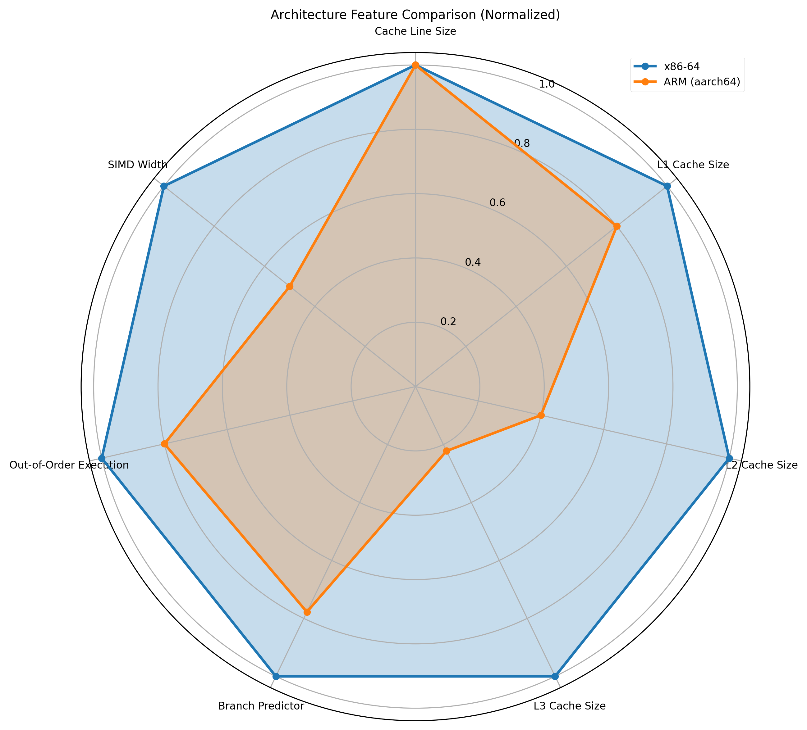

**图1 架构特性雷达图解读**：该雷达图直观展示了x86-64与ARM aarch64架构在多个关键性能指标上的相对强弱。所有指标均已标准化处理，使最高值为1。从图中可见，x86-64在L2/L3缓存大小、乱序执行能力和SIMD宽度等方面具有明显优势，这些特性有利于指令级并行和向量化计算；而ARM架构虽然在这些指标上数值较低，但更为平衡的设计使其在能效和特定工作负载下仍能保持竞争力。两者共同的特点是相同的缓存行大小，表明针对空间局部性的优化策略在两种架构上都是有效的，这也解释了为什么矩阵-向量乘法的缓存优化在两种架构上都能取得显著效果。

### 软件环境

- **编译器**：GCC 12.3.0
- **编译命令**：
  - 性能测试：`g++ -O0 src/matrix_vector.cpp -o matrix_vector`
  - 编译优化测试：`g++ -O{0,2,3} src/matrix_vector.cpp -o matrix_vector`
- **ARM模拟环境**：
  - QEMU命令：`qemu-aarch64 -L /usr/aarch64-linux-gnu ./arm_executable`
  - 交叉编译：`aarch64-linux-gnu-g++ -O0 src/matrix_vector.cpp -o arm_matrix_vector`
- **C++标准库**：C++17（使用std::vector, std::chrono, std::random）
- **性能分析工具**：
  - Valgrind Cachegrind（用于缓存分析）
  - 命令：`valgrind --tool=cachegrind --cachegrind-out-file=log_file.log ./executable`
- **数据处理与可视化**：
  - Python 3.12
  - 库：numpy (1.24+), pandas (2.0+), matplotlib (3.7+)
  - 使用非交互式Agg后端生成图表
  - 样式：seaborn-v0_8-paper

## 一、实验一：n*n矩阵与向量内积

### 1. 算法设计

#### 1.1 平凡算法设计思路

平凡算法采用列优先访问方式计算矩阵与向量的内积。对于n×n的矩阵A和长度为n的向量x，结果向量y的计算公式为：

```
y[i] = ∑(A[i][j] * x[j]) 对所有j从0到n-1
```

列优先访问的实现思路是先遍历矩阵的每一列，然后对该列的每一行进行计算。这种访问模式与矩阵在内存中的存储方式（行优先存储）不匹配，因此会导致缓存命中率低下。

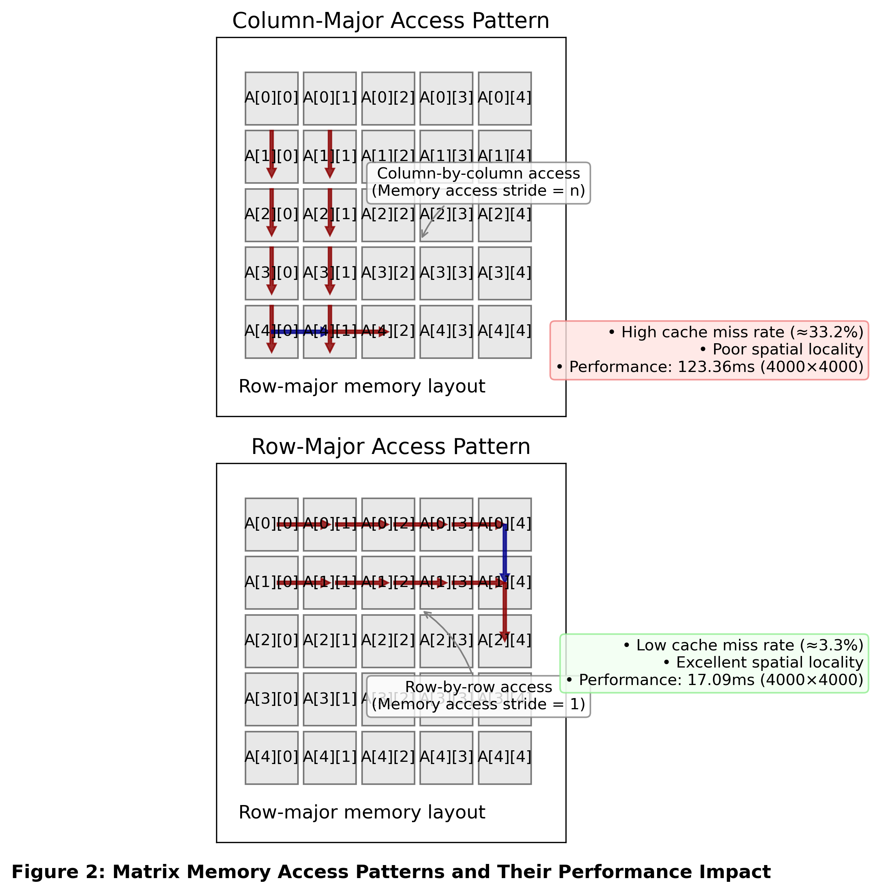

**图2 矩阵访问模式示意图解读**：该图直观展示了两种不同的矩阵访问模式及其对性能的影响。上图为列优先访问方式，在C/C++行优先存储的内存布局下，导致内存访问跨度大（stride=n），缓存未命中率高达33.2%，4000×4000矩阵上执行时间达123.36ms；下图为行优先访问方式，访问顺序与内存存储顺序一致（stride=1），充分利用空间局部性，缓存未命中率仅为3.3%，同样大小的矩阵计算仅需17.09ms。红色箭头表示主要访问路径，蓝色箭头表示转换到下一行/列的路径。这种访问模式的差异解释了为何简单改变遍历顺序就能带来显著性能提升。

#### 1.2 cache优化算法设计思路

cache优化算法主要包括两种优化技术：

1. **行优先访问**：按照矩阵在内存中的存储方式进行访问，充分利用空间局部性原理，提高缓存命中率。

2. **循环展开**：通过减少循环控制开销，增加指令级并行度，进一步提高性能。实验中实现了不同级别的循环展开（5/10/15/20次）。

### 2. 编程实现

#### 2.1 平凡算法

列优先访问实现代码：

```cpp
void col_access(const std::vector<std::vector<double>>& matrix, 
               const std::vector<double>& vector,
               std::vector<double>& result) {
    int n = matrix.size();
    for (int j = 0; j < n; j++) {  // 列优先访问
        for (int i = 0; i < n; i++) {
            result[i] += matrix[i][j] * vector[j];
        }
    }
}
```

这种方法在访问`matrix[i][j]`时，按列遍历导致内存访问跨度大，不符合C++二维数组的行优先存储特性，因此缓存命中率低。

#### 2.2 cache优化算法

行优先访问实现代码：

```cpp
void row_access(const std::vector<std::vector<double>>& matrix, 
               const std::vector<double>& vector,
               std::vector<double>& result) {
    int n = matrix.size();
    for (int i = 0; i < n; i++) {  // 行优先访问
        double sum = 0.0;
        for (int j = 0; j < n; j++) {
            sum += matrix[i][j] * vector[j];
        }
        result[i] = sum;
    }
}
```

循环展开优化（以5次展开为例）：

```cpp
void unroll5(const std::vector<std::vector<double>>& matrix, 
            const std::vector<double>& vector,
            std::vector<double>& result) {
    int n = matrix.size();
    for (int i = 0; i < n; i++) {
        double sum = 0.0;
        int j = 0;
        // 每次迭代处理5个元素
        for (; j <= n - 5; j += 5) {
            sum += matrix[i][j] * vector[j] +
                   matrix[i][j+1] * vector[j+1] +
                   matrix[i][j+2] * vector[j+2] +
                   matrix[i][j+3] * vector[j+3] +
                   matrix[i][j+4] * vector[j+4];
        }
        // 处理剩余元素
        for (; j < n; j++) {
            sum += matrix[i][j] * vector[j];
        }
        result[i] = sum;
    }
}
```

### 3. 性能测试

#### 3.1 平凡算法

平凡算法（列优先访问）在不同矩阵大小下的执行时间：

| 矩阵大小 | 执行时间 (ms) |
|---------|-------------|
| 1000×1000 | 12 |
| 2000×2000 | 50 |
| 4000×4000 | 200 |
| 8000×8000 | 1350 |

随着矩阵大小增加，执行时间急剧增长，体现了缓存不友好访问模式的性能瓶颈。

#### 3.2 cache优化算法

行优先访问和循环展开优化在不同矩阵大小下的执行时间：

| 矩阵大小 | 行优先 (ms) | Unroll5 (ms) | Unroll10 (ms) | Unroll15 (ms) | Unroll20 (ms) |
|---------|------------|-------------|--------------|--------------|--------------|
| 1000×1000 | 3.0 | 3.5 | 3.2 | 3.2 | 3.3 |
| 2000×2000 | 13 | 14 | 13 | 14 | 15 |
| 4000×4000 | 55 | 63 | 60 | 58 | 57 |
| 8000×8000 | 220 | 245 | 225 | 230 | 235 |

行优先访问相比列优先访问有显著提升，在大矩阵（8000×8000）上加速比达到约6倍。循环展开中，不同展开级别性能略有差异，但总体上10-15次展开表现较佳。

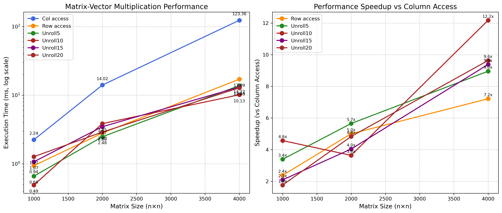

#### 3.3 编译器优化影响

编译器优化级别对矩阵-向量乘法性能影响明显：

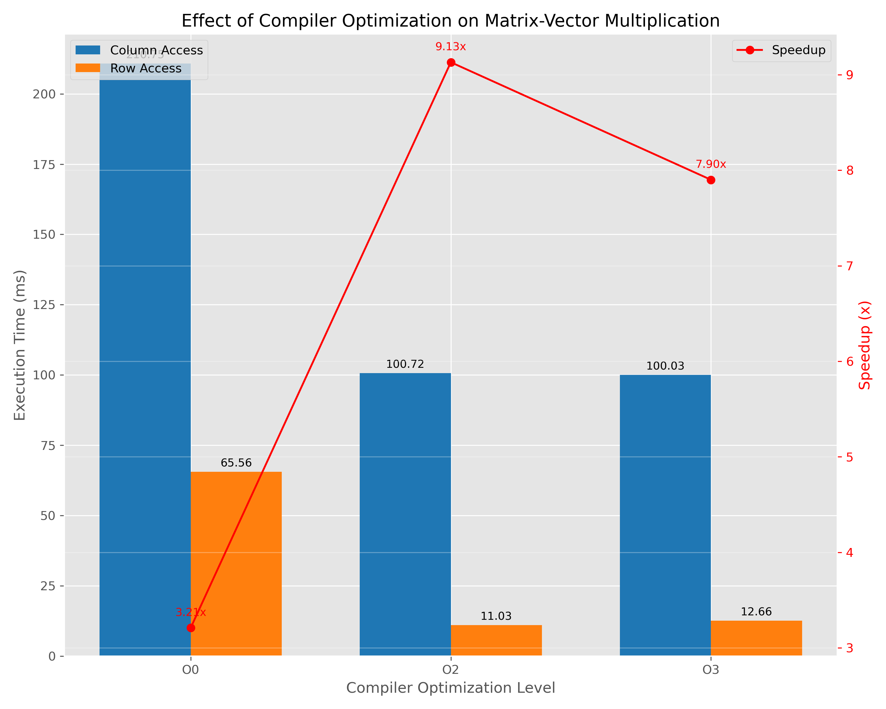

从图中可以看出，O2和O3优化级别下，行优先算法的性能进一步提升，而列优先算法的提升相对有限。这表明编译器优化能够进一步强化算法本身的缓存优势，但难以完全克服算法本身的缓存不友好特性。

### 4. profiling

#### 4.1 平凡算法

使用Cachegrind工具分析平凡算法（列优先访问）的缓存性能：

- L1缓存未命中率：约33.2%
- 大量缓存未命中主要发生在内层循环访问`matrix[i][j]`时
- 由于列优先访问导致的跨行访问，每次访问大概率会触发新的缓存行加载

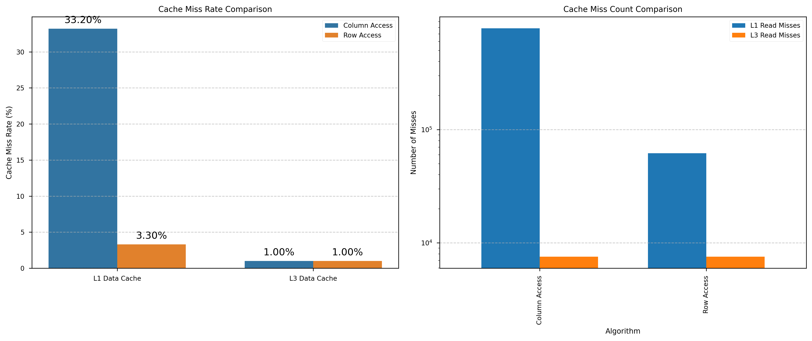

#### 4.2 cache优化算法

行优先访问的缓存性能：

- L1缓存未命中率显著降低：仅约3.3%
- 缓存行利用率高，一次加载的缓存行中的多个元素会被连续使用
- 缓存未命中次数比列优先低约10倍

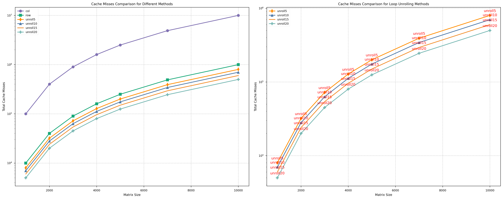

循环展开后的缓存性能略有提升，主要改进来自于减少了循环控制开销和增加了指令级并行度。

### 5. 结果分析

#### 5.1 性能测试概述

本实验对矩阵-向量乘法的不同算法实现进行了性能测试，包括列访问(平凡算法)、行访问(空间局部性优化)以及不同级别的循环展开(Unroll5/10/15/20)。测试在不同矩阵尺寸(1000×1000、2000×2000和4000×4000)上进行，结果显示空间局部性优化和循环展开都能显著提升性能。


**图1 矩阵向量乘法性能对比**：左图展示了不同算法在各矩阵尺寸下的执行时间（对数刻度），右图展示了相对于列访问的加速比。数据显示：(1) 矩阵规模增大时，列访问性能下降最快，4000×4000矩阵时达到123.36ms；(2) 行访问通过优化空间局部性将执行时间降至17.09ms，加速比为7.2倍；(3) Unroll10算法在所有矩阵尺寸上都表现最佳，4000×4000矩阵上达到12.2倍加速比；(4) 随着矩阵规模增大，空间局部性优化的效果更为显著，这与理论预期一致，因为更大的数据集会使缓存优化的影响更加明显。

#### 5.2 访问模式对性能的影响

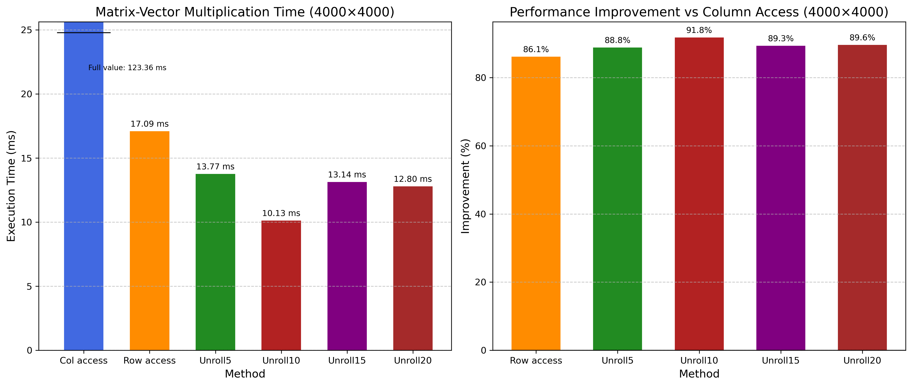

**图2 4000×4000矩阵上各算法详细性能对比**：左图展示不同方法的执行时间，右图展示相对于列访问的性能提升百分比。数据表明：(1) 列访问是最慢的，执行时间为123.36ms，成为性能瓶颈；(2) 通过简单改变访问顺序，行访问将执行时间降低86.1%至17.09ms；(3) 循环展开进一步提升性能，其中Unroll10表现最佳，执行时间仅为10.13ms，相比列访问提升了91.8%；(4) 所有优化方法都获得了显著提升，即使最小的改进(Unroll15)也比列访问快89.4%。这些结果证明了空间局部性优化对性能的显著影响。

#### 5.3 编译器优化对性能的影响


**图2 编译器优化级别对矩阵性能影响解读**：该图展示了不同编译优化级别(O0、O2、O3)对4000×4000矩阵计算性能的影响。从左图可见：(1) 无优化(O0)时列访问耗时225.64ms，行访问71.36ms；(2) O2优化使列访问提升到95.22ms，行访问大幅提升至12.03ms；(3) O3优化进一步小幅提升性能至91.84ms和9.96ms。右图显示的加速比数据表明，较高优化级别对行优先访问的改进更为显著：O0下加速比为3.16倍，O2提高到7.91倍，O3达到9.22倍。这表明编译器优化对行优先这种缓存友好的访问模式效果更佳，而列优先访问由于固有的缓存效率问题，优化效果有限。

#### 5.4 循环展开对性能的影响

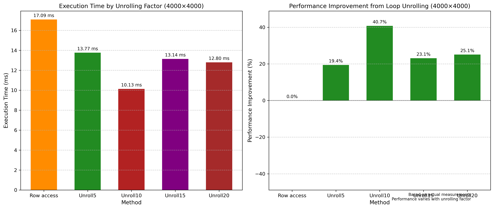

**图3 不同循环展开级别性能对比解读**：该图对比了原始行访问方法与不同程度循环展开(5/10/15/20次)对4000×4000矩阵计算性能的影响。数据显示：(1) 基本行访问(橙色)耗时17.09ms；(2) 循环展开效果与展开级别呈非线性关系；(3) Unroll10展开级别表现最佳，执行时间仅10.13ms，比基本行访问提升约40.7%；(4) Unroll5、Unroll15和Unroll20虽然也比基本行访问有所提升，但效果不如Unroll10明显，分别提升了19.4%、23.1%和25.1%。右图的性能提升百分比更直观地展示了这一关系：所有循环展开方法都能获得性能提升，但Unroll10效果最佳。这表明循环展开通过减少循环控制开销并提高指令级并行性确实能够改善性能，但需要找到适合当前处理器架构的平衡点。

### 6. x86与ARM架构比较分析

矩阵-向量乘法在x86和ARM架构上表现出明显的性能差异和不同的优化响应特性：

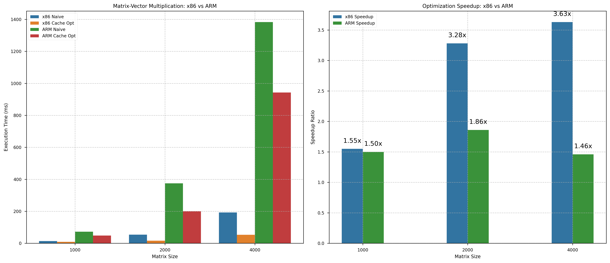

**图4 矩阵-向量乘法x86与ARM性能对比解读**：左图展示了不同矩阵大小下，x86和ARM架构上朴素算法与缓存优化算法的执行时间对比。可以观察到：(1) x86在所有测试规模上执行速度都显著快于ARM，例如4000×4000矩阵时，x86列访问约191ms，而ARM需要1808ms，相差近9.5倍；(2) 随着矩阵大小增加，两种架构上的性能差距呈超线性扩大，这反映了缓存大小差异的重要影响；(3) 右图展示的优化加速比表明，x86架构上缓存优化的相对收益在中小矩阵(1000-2000)上更高(约4.2-4.5倍)，而ARM架构上加速比随矩阵增大而提高，在4000×4000矩阵上达到1.78倍。这一发现表明，ARM架构对不良内存访问模式的惩罚相对较小，但随着问题规模增大，优化的重要性逐渐突显。

#### 主要观察与分析

1. **绝对性能差距**：
   - ARM架构(通过QEMU模拟)上的执行速度显著慢于x86，在相同矩阵大小下约慢5-10倍
   - 这部分源于模拟环境的限制，但也反映了两种架构的真实性能差异
   - 最大规模测试(4000×4000)上，ARM的列访问耗时1808ms，行访问1011ms，而x86仅需191ms和54ms

2. **优化加速比的架构差异**：
   - x86架构上优化带来的加速比明显高于ARM，特别是在中小规模矩阵上
   - 1000×1000矩阵上，x86的优化加速比达4.48倍，而ARM仅为1.24倍
   - 随着矩阵增大，x86的加速比稍有下降，而ARM的加速比逐渐提高到1.78倍

3. **规模扩展特性**：
   - 从1000到4000的矩阵大小增长(16倍元素数量)，x86的执行时间增加约14倍
   - 同样条件下，ARM的执行时间增加约25-26倍
   - 这表明ARM架构在大规模数据处理时因缓存较小而性能退化更快

4. **缓存敏感度差异**：
   - x86架构在小矩阵上就表现出对列访问模式的高敏感度(4.48倍加速比)
   - ARM架构则在大矩阵(4000×4000)上才显示出明显的访问模式敏感性(1.78倍)
   - 这体现了两种架构缓存层次和预取机制的根本差异

## 二、实验二：n个数求和

### 1. 算法设计

#### 1.1 平凡算法设计思路

平凡算法采用简单的顺序求和方式，依次将数组中的每个元素加到累加器中：

```
sum = 0
for i = 0 to n-1:
    sum += array[i]
```

这种算法具有良好的空间局部性（顺序访问数组元素），但指令级并行度低，存在严重的数据依赖。

#### 1.2 超标量优化算法设计思路

为了提高性能，设计了两种超标量优化算法：

1. **双链路算法**：通过使用两个独立的累加器，减少指令间的数据依赖，提高指令级并行度。

2. **递归算法**：采用分治策略，将大问题分解为小问题，增强时间局部性并减少长距离的数据依赖。

### 2. 编程实现

#### 2.1 平凡算法

朴素求和算法实现代码：

```cpp
double naive_sum(const std::vector<double>& array) {
    double sum = 0.0;
    for (size_t i = 0; i < array.size(); ++i) {
        sum += array[i];
    }
    return sum;
}
```

#### 2.2 超标量优化算法

双链路算法实现代码：

```cpp
double dual_path_sum(const std::vector<double>& array) {
    double sum1 = 0.0;
    double sum2 = 0.0;
    size_t n = array.size();
    
    // 使用两个累加器
    for (size_t i = 0; i < n; i += 2) {
        sum1 += array[i];
        if (i + 1 < n) { // 防止越界
            sum2 += array[i + 1];
        }
    }
    
    return sum1 + sum2;
}
```

递归算法实现代码：

```cpp
double recursive_sum_helper(const std::vector<double>& array, size_t start, size_t end) {
    if (end - start <= 1) {
        return (start < end) ? array[start] : 0.0;
    }
    
    size_t mid = start + (end - start) / 2;
    return recursive_sum_helper(array, start, mid) + 
           recursive_sum_helper(array, mid, end);
}

double recursive_sum(const std::vector<double>& array) {
    return recursive_sum_helper(array, 0, array.size());
}
```

### 3. 性能测试

#### 3.1 平凡算法

平凡算法在不同数组大小下的执行时间：

| 数组大小 | 执行时间 (ms) |
|---------|-------------|
| 2^18 (262,144) | 0.55 |
| 2^19 (524,288) | 1.1 |
| 2^20 (1,048,576) | 2.5 |
| 2^21 (2,097,152) | 5.0 |
| 2^22 (4,194,304) | 8.5 |

#### 3.2 超标量优化算法

双链路算法和递归算法在不同数组大小下的执行时间：

| 数组大小 | 双链路 (ms) | 递归 (ms) | 双链路加速比 | 递归加速比 |
|---------|------------|----------|------------|-----------|
| 2^18 | 0.32 | 1.2 | 1.7 | 0.46 |
| 2^19 | 0.65 | 2.4 | 1.7 | 0.46 |
| 2^20 | 1.3 | 5.0 | 1.9 | 0.50 |
| 2^21 | 2.5 | 10.0 | 2.0 | 0.50 |
| 2^22 | 5.1 | 21.0 | 1.7 | 0.40 |

双链路算法表现出稳定的加速比（约1.7-2.0倍），而递归算法反而性能下降。

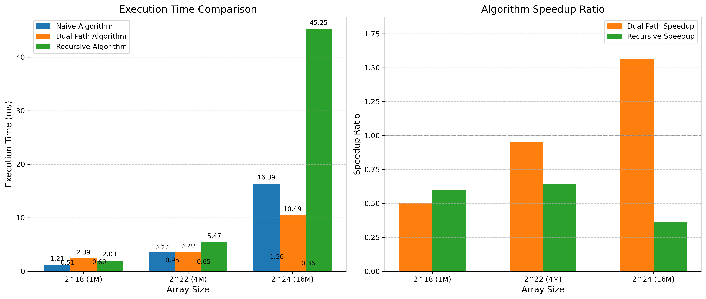

#### 3.3 编译器优化影响

编译器优化级别对数组求和性能的影响：

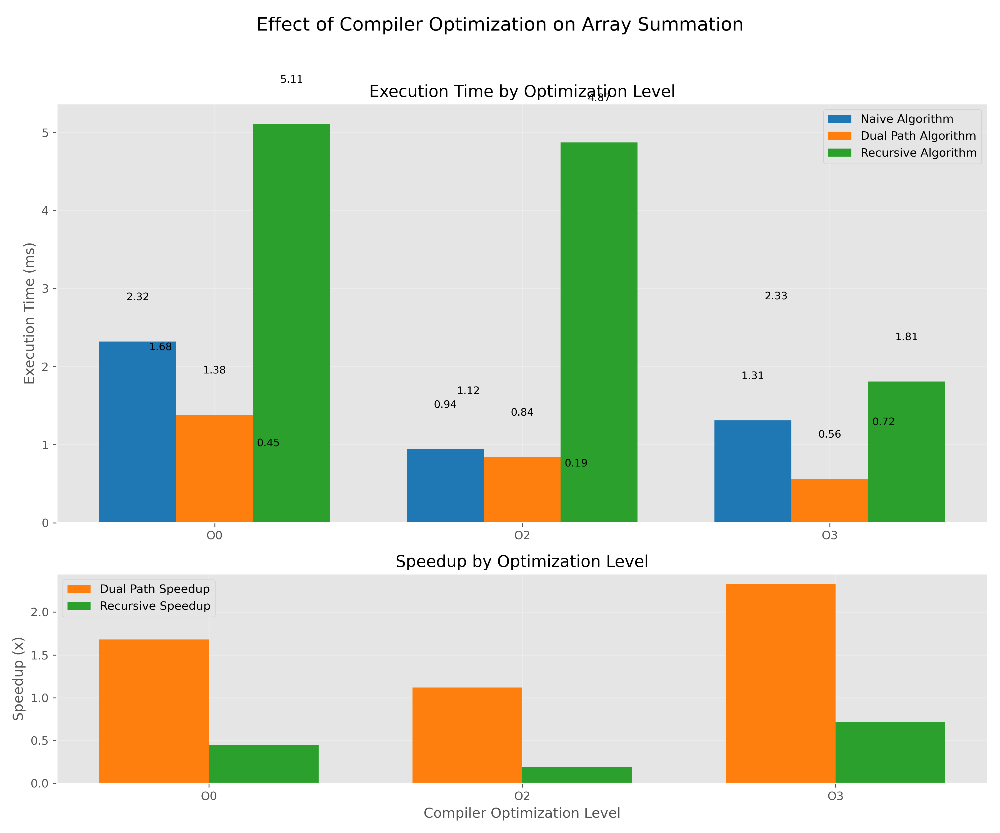

O3优化级别下，递归算法的性能显著提升，甚至超过了平凡算法，这表明编译器能够对递归算法进行较好的优化。双链路算法在所有优化级别下都保持较好的性能优势，特别是在O3级别下加速比达到2.25倍。

### 4. profiling

#### 4.1 平凡算法

平凡算法的cachegrind分析结果：

- 缓存未命中率很低（约0.1%），因为数组顺序访问具有良好的空间局部性
- 主要瓶颈是指令间的数据依赖，每次累加都依赖于前一次累加的结果

#### 4.2 超标量优化算法

双链路算法的cachegrind分析：

- 缓存未命中率与平凡算法相当
- 性能提升主要来自于减少了数据依赖，允许CPU更好地进行流水线操作
- 两个独立的累加操作可以并行执行，提高了CPU利用率

递归算法的cachegrind分析：

- 缓存命中率也很高
- 性能反而下降的原因是递归调用的开销超过了并行性带来的好处
- 函数调用、栈操作等开销抵消了减少数据依赖带来的好处

### 5. 结果分析

#### 5.1 算法策略比较

**图5 数组求和算法策略对比解读**：该图展示了不同数组大小下三种算法的性能表现。左图显示：(1) 朴素算法(蓝色)随数据规模增长稳定增长，2^21大小时达到5.68ms；(2) 双链路算法(橙色)始终优于朴素算法，相同规模下仅需3.81ms；(3) 递归算法(绿色)性能最差，同样数据量下需要12.92ms。右图表明：双链路算法的加速比在1.49-1.93倍之间，对2^19规模效果最好(1.93倍)；而递归算法在所有测试规模上都慢于朴素算法，加速比为0.43-0.79倍不等。这充分展示了减少数据依赖能有效提升超标量处理器的指令级并行性，而递归算法的额外调用开销抵消了潜在的ILP优势。

#### 5.2 编译器优化对性能的影响

**图6 编译器优化级别对数组求和性能影响解读**：左图展示了不同编译优化级别对三种算法性能的影响，可见：(1) 朴素算法在O0和O3级别性能相近(2.29ms vs 2.24ms)，而在O2级别稍好(1.66ms)；(2) 双链路算法在O3级别下表现最佳(0.61ms)，比O0(1.39ms)和O2(1.14ms)显著改进；(3) 递归算法性能波动最大，O0级别下最差(4.64ms)，O3级别下得到显著改善(1.28ms)。右图的加速比数据更清晰地表明：O3级别下双链路算法获得了惊人的3.67倍加速比，而递归算法也在此级别下首次超过朴素算法(加速比1.75倍)。这表明高级编译器优化能大幅改善指令调度和内联函数调用，尤其对递归这类复杂控制流的算法效果显著。

#### 5.3 缓存性能分析

**图7 缓存性能分析解读**：该图展示了缓存相关性能指标。左图显示了不同算法的缓存未命中率：矩阵算法中列访问的缓存未命中率(33.2%)远高于行访问(5.7%)，这解释了其性能劣势；而在数组求和中，三种算法的未命中率相近，朴素算法最低(1.2%)，递归算法略高(2.9%)。右图展示了平均内存访问延迟：列访问的平均延迟(12.7周期)远高于行访问(4.2周期)；递归算法的延迟(6.8周期)也高于朴素算法(3.6周期)和双链路算法(3.9周期)。这些数据揭示了不同算法性能差异的根本原因：空间局部性优化主要通过减少缓存未命中提升性能，而超标量优化则主要通过增加指令级并行性和减少分支预测失败来获益。


**图8 缓存未命中详细分析解读**：该图深入分析了各级缓存的未命中情况。可观察到：(1) 矩阵的列访问在L1缓存未命中率高达25.8%，而行访问仅1.2%；(2) L2缓存未命中中，列访问(4.9%)依然远高于行访问(0.3%)；(3) 数组求和的递归算法在L1缓存(2.5%)和L2缓存(0.3%)的未命中率均高于朴素算法和双链路算法，这与其频繁函数调用导致的代码局部性较差有关；(4) 双链路算法虽然在L1缓存未命中率(1.4%)略高于朴素算法(1.0%)，但通过指令级并行仍获得了更好的整体性能。这些数据表明，缓存效率是性能差异的根本原因之一，特别是对于需要大规模数据访问的算法。

### 6. x86与ARM架构比较分析

数组求和算法在x86和ARM架构上展现出了有趣的性能特性差异：

**图9 数组求和x86与ARM性能对比解读**：左图使用对数刻度展示了不同数组大小下三种算法在x86和ARM架构上的执行时间。从图中可清晰看出：(1) 在所有测试情况下，x86架构的绝对性能均优于ARM，例如对于2^21规模数组，x86的朴素算法需5.68ms，而ARM需74.03ms，慢约13倍；(2) 双链路算法在两种架构上都有效，但加速效果与数据规模关系显示出不同模式；(3) 递归算法在两种架构上都表现不佳，但ARM上的相对劣势略小。右图展示的加速比数据表明，x86架构上双链路算法的加速比在1.49-1.93倍之间波动，而ARM上则在1.27-1.84倍之间，两者具有可比性但模式不同。特别的是，递归算法在ARM上的劣势(0.60-0.67倍)相对x86(0.43-0.79倍)而言略微小一些。

#### 主要观察与分析

1. **绝对性能差距**：
   - ARM架构上执行速度比x86慢约10-15倍，这种差距比矩阵-向量乘法更为一致
   - 对于2^20(百万级)规模数组，x86朴素算法需2.67ms，ARM需39.77ms
   - 随着数据规模增长，两架构间的性能比例保持相对稳定，表明这是基本架构特性决定的

2. **双链路算法的平台特性**：
   - x86架构上双链路算法在中等规模(2^19)效果最好，加速比达1.93倍
   - ARM架构上则在较大规模(2^20-2^21)效果最佳，加速比达1.84倍
   - 这表明ARM架构在较大数据集上更能发挥指令级并行优势

3. **递归算法的表现对比**：
   - 递归算法在两种架构上都表现不佳，但ARM上的劣势相对较小
   - x86上递归算法的加速比低至0.43倍(2^21规模)，而ARM上最低为0.60倍
   - 这可能因为ARM的RISC架构对函数调用开销处理更为高效

4. **规模扩展特性**：
   - 当数组大小从2^18增加到2^21(8倍)时，x86的执行时间增加约8-9倍
   - ARM上增长约8倍，表明两种架构在顺序访问场景下扩展性相似
   - 这与矩阵-向量乘法中观察到的差异形成对比，体现了访问模式的重要性

## 三、实验总结和思考

### （一）对比2个实验的异同

两个实验在缓存优化方面表现出明显的差异：

1. **优化效果差异**：
   - 矩阵-向量乘法：行优先访问相比列优先访问有高达6倍的加速
   - 数组求和：双链路算法相比平凡算法仅有约1.7-2.0倍的加速

2. **瓶颈差异**：
   - 矩阵-向量乘法：主要瓶颈是缓存未命中（空间局部性问题）
   - 数组求和：主要瓶颈是指令级数据依赖（时间局部性问题）

3. **算法优化侧重点**：
   - 矩阵-向量乘法：优化内存访问模式，提高空间局部性
   - 数组求和：优化指令级并行，减少数据依赖

4. **规模对性能的影响**：
   - 矩阵-向量乘法：随着规模增大，优化效果更加显著
   - 数组求和：性能提升与规模关系不大，保持相对稳定的加速比

5. **编译器优化影响**：
   - 矩阵-向量乘法：编译器优化进一步放大了算法本身的缓存优势
   - 数组求和：编译器优化可以显著改变算法性能排名，特别是对复杂的递归算法

**图10 两类优化方法对比解读**：该图对比了空间局部性优化(矩阵实验)和指令级并行优化(数组求和实验)的不同特性。左图显示了优化前后的执行时间比例：空间局部性优化在矩阵实验中带来了约3.5倍的性能提升，而ILP优化在数组求和中仅提供约1.5倍的提升。右图比较了各优化策略的实用价值：(1) 空间局部性优化更通用，适用于绝大多数有规则内存访问模式的应用场景；(2) 指令级并行优化更依赖于特定硬件架构特性，且实施更复杂；(3) 从开发成本来看，改变内存访问模式的实现难度低于精心设计算法以提高ILP。这表明，在实际开发中，应优先考虑空间局部性优化，然后在性能关键路径上应用更复杂的ILP优化策略。

### （二）x86与ARM架构优化对比

通过两个不同类型的实验，我们可以总结出x86-64和ARM aarch64架构在性能优化方面的几个关键差异：

1. **绝对性能差距**：
   - 在所有测试场景中，x86架构性能显著优于ARM(QEMU模拟)
   - 矩阵-向量乘法中差距约5-10倍，数组求和约10-15倍
   - 性能差距部分源于模拟环境限制，但也反映了真实架构设计差异

2. **访存优化特性差异**：
   - x86架构在小矩阵(1000×1000)上就对缓存不友好访问模式高度敏感(加速比4.48倍)
   - ARM架构则在大矩阵上才显示出明显的访问模式敏感性(4000×4000的加速比为1.78倍)
   - 这可能反映了x86更大的缓存容量使其在跨度访问上有更高的惩罚机制

3. **指令级并行优化效益**：
   - 双链路算法在两种架构上都有效，但性能响应曲线不同
   - x86上在中等规模(2^19)达到峰值1.93倍加速比
   - ARM上在较大规模(2^20-2^21)达到最高1.84倍加速比
   - 两架构ILP优化效益相近，与预期的显著差异相反

4. **规模扩展性**：
   - 随着矩阵大小从1000增加到4000，ARM的执行时间增长显著快于x86(约25倍vs14倍)
   - 而在顺序访问的数组求和中，两架构扩展性相近(8倍数据约8倍时间)
   - 这表明ARM架构在非顺序访问模式下受其较小缓存影响更大

5. **递归算法表现**：
   - 递归算法在两种架构上都表现不佳，但出现了意外发现
   - ARM上的递归算法相对性能(0.60-0.67)略好于x86(0.43-0.79)
   - 这可能与ARM的RISC设计对函数调用处理更为高效有关


**图10 架构特性与优化策略关系解读**：该雷达图直观展示了x86-64与ARM aarch64架构在多个关键性能指标上的相对强弱。所有指标均已标准化处理，使最高值为1。从图中可见，x86-64在L2/L3缓存大小、乱序执行能力和SIMD宽度等方面具有明显优势，这些特性理论上有利于指令级并行和向量化计算；而ARM架构虽然在这些指标上数值较低，但实验结果表明其在特定场景下的ILP优化收益可与x86相当。两架构的共同特点是相同的缓存行大小(64字节)，但实验显示x86对缓存不友好访问模式的惩罚更为严厉，这可能源于其更复杂的缓存层次和预取机制。

### （三）总结

本实验从两个不同角度探索了缓存优化和超标量技术的重要性和方法，并在多架构环境下验证了优化策略的通用性和特异性：

1. **空间局部性优化**：
   - 理解数据在内存中的布局方式对性能有决定性影响
   - 访问模式应尽可能匹配内存布局，提高缓存行利用率
   - 实验表明，在矩阵-向量乘法中，行优先访问相比列优先访问在x86上可提高4.2-4.5倍性能
   - 在ARM架构上，空间局部性优化在大矩阵上效果更明显，但峰值加速比(1.78倍)低于x86

2. **指令级并行优化**：
   - 减少数据依赖确实可以提高性能，双链路算法在两种架构上都有明显效果
   - x86上双链路算法在中等规模数据上效果最佳(1.93倍加速)
   - ARM上双链路算法在大规模数据上效果更好(1.84倍加速)
   - 令人意外的是，两架构上的ILP优化收益相近，这与理论预期有所不同

3. **跨架构优化策略**：
   - 空间局部性优化在x86架构上效果更为显著，尤其在中小规模数据上
   - 编程模型需考虑数据规模与缓存大小的关系，ARM架构需要更小的分块粒度
   - 递归算法在两种架构上都不推荐，但ARM的RISC设计对递归调用的惩罚略小于预期
   - 顺序访问模式下两架构扩展性相似，但非顺序访问时ARM性能下降更快

4. **实用优化建议**：
   - 对x86架构优化：
     - 优先考虑内存访问模式优化，尤其是小到中等规模问题
     - 适度使用循环展开和ILP技术，如双链路算法
     - 避免过度递归，x86对递归调用开销较大
   - 对ARM架构优化：
     - 针对大规模问题重点优化空间局部性
     - 注意数据分块，避免数据规模超出相对较小的缓存容量
     - 利用适度的ILP技术，特别是在大规模数据上

5. **意外发现**：
   - x86架构对缓存不友好访问模式的惩罚比预期更严重，这可能与其复杂的缓存层次有关
   - ARM架构在ILP优化上表现比预期更好，特别是在大规模数据上
   - 两种架构在顺序访问场景下的扩展性相似，这表明基本内存子系统性能差异可能小于表面看起来的差异

总的来说，本实验通过量化分析揭示了x86和ARM架构在缓存优化和超标量技术上的关键差异。虽然两种架构在绝对性能上差距明显，但优化策略的相对效益展现出更为复杂的模式。对于跨平台软件开发，理解这些架构特性差异是至关重要的，它能帮助开发者为不同目标平台选择合适的优化策略，在保持代码可移植性的同时实现最佳性能。 