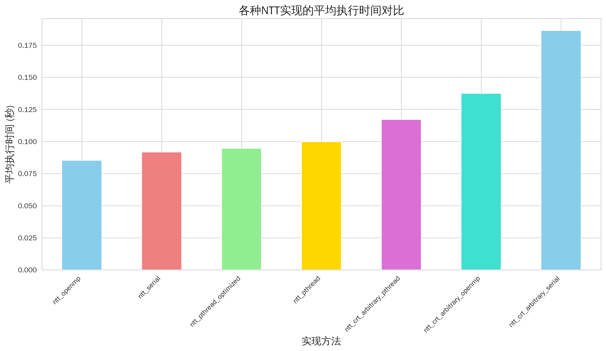
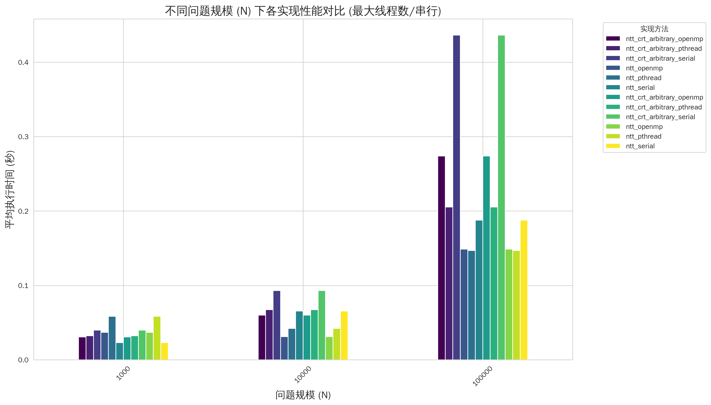
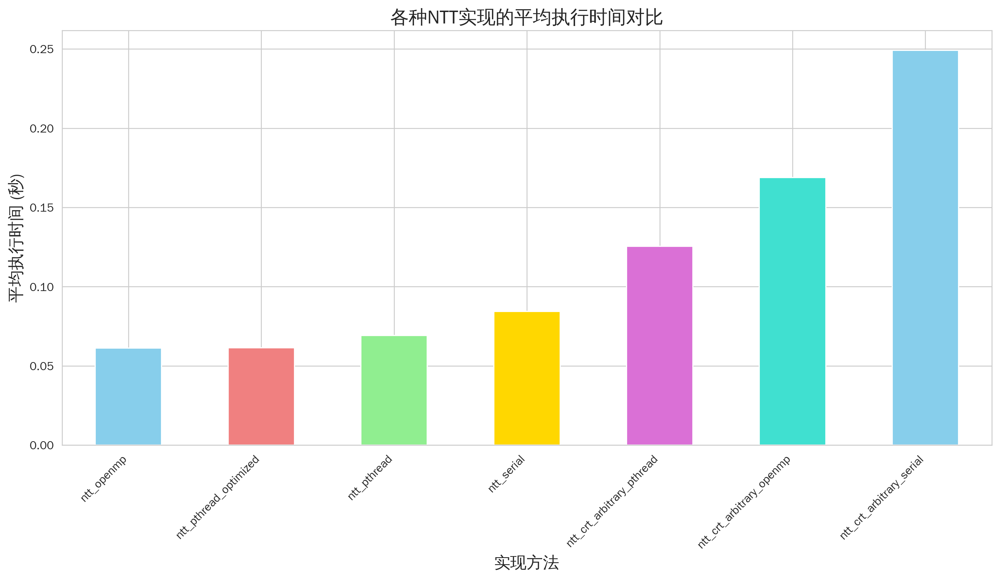
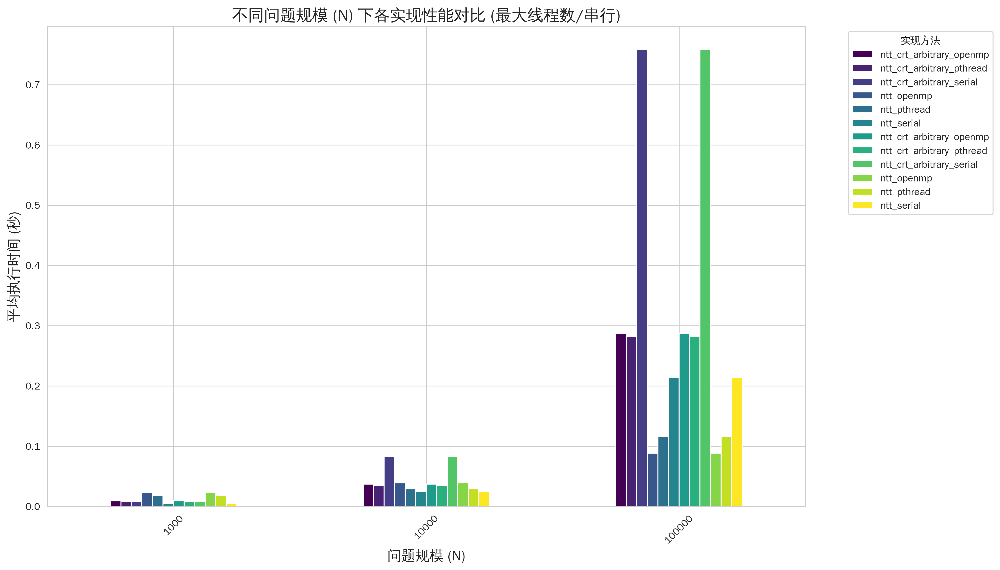
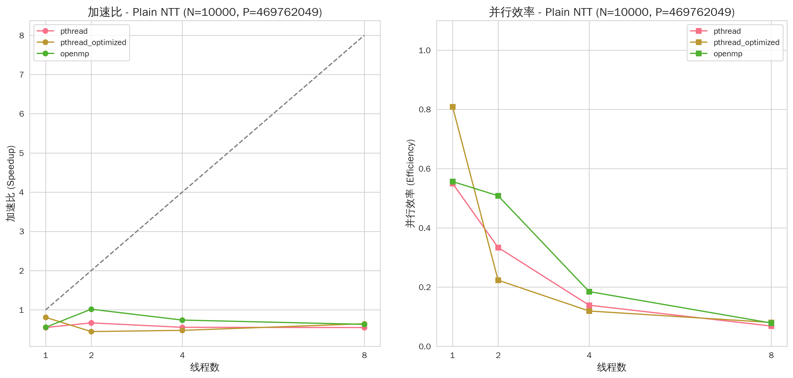
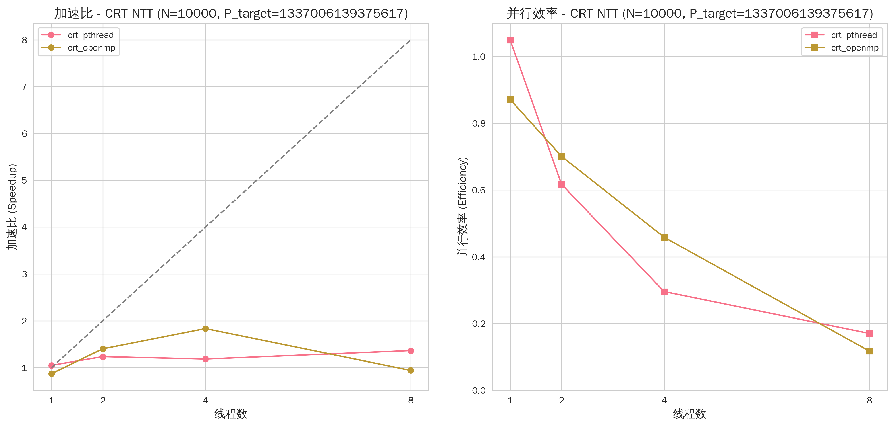
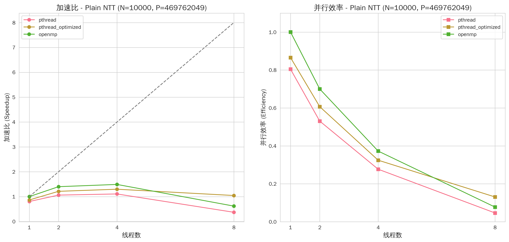
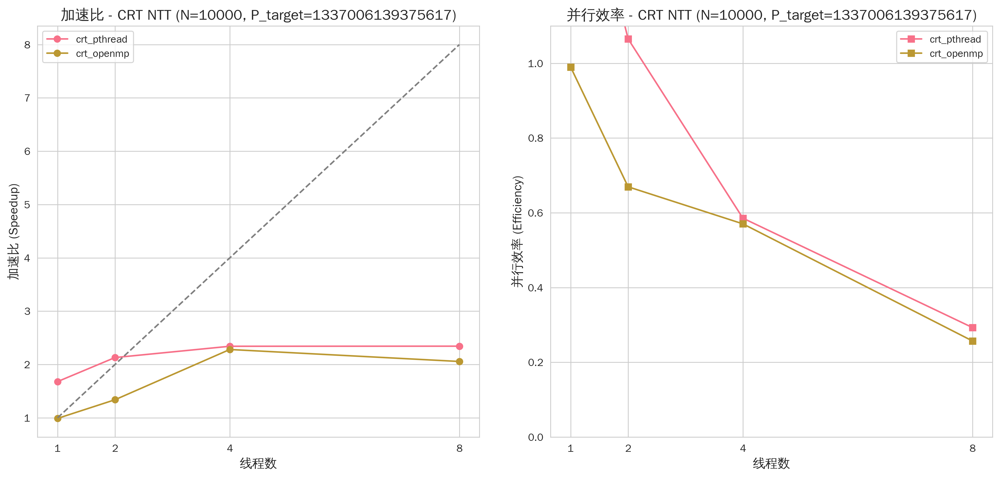

# NTT算法并行优化实验报告

## 1. 实验概述

### 1.1 研究背景与意义
数论变换（NTT）是快速傅里叶变换（FFT）在有限域上的变体，广泛应用于大数乘法、多项式乘法、纠错码、密码学等领域。随着数据规模的持续增长和对计算效率要求的不断提高，针对NTT算法的性能优化，特别是并行计算优化，具有重要的理论研究价值和实际应用意义。

本实验基于数论变换(Number Theoretic Transform, NTT)算法实现了多种并行优化方案，包括基础NTT算法的pthread/OpenMP并行化、pthread线程池优化以及基于中国剩余定理(CRT)的多模数NTT并行优化。通过增强版测试，深入分析了不同并行方案的性能表现，特别是pthread线程池优化的效果。

### 1.2 实验目标
- 实现NTT算法的串行版本
- 使用Pthread和OpenMP技术对基础NTT算法进行多线程并行化优化
- 实现基于CRT的任意模数NTT算法的串行版本
- 使用Pthread和OpenMP技术对CRT任意模数NTT算法进行多线程并行化优化
- 实现pthread线程池优化版本，深入分析其性能特征
- 设计并执行综合测试脚本，系统地评估不同实现版本在多种问题规模、模数和线程配置下的性能（在x86和ARM两个不同架构平台上）
- 分析不同并行策略（Pthread vs OpenMP）的加速效果、可扩展性以及在不同场景下的适用性（对比x86与ARM平台的差异）
- 重点考察CRT任意模数NTT在大模数（包括接近`__int128`极限）情况下的性能和正确性
- 生成实验结果图表（区分x86和ARM平台），并撰写实验报告，总结研究成果

## 2. 相关理论基础

### 2.1 NTT算法原理
数论变换(NTT)是一种用于计算多项式乘法（卷积）的快速算法。与FFT使用复数单位根不同，NTT使用模质数的原根，避免了浮点运算的精度问题。

NTT的核心思想是：
1. 选择适当的质数p和原根g，使得g^((p-1)/n) ≡ ωn (mod p)
2. 利用分治思想递归计算变换
3. 通过蝶形运算实现高效计算

NTT的核心步骤包括：
1. **位逆序置换 (Bit-reversal Permutation)**：重新排列输入序列，以便进行蝶形运算
2. **蝶形运算 (Butterfly Operation)**：迭代地计算NTT。对于长度为N的变换，共进行logN层迭代，每层包含N/2个蝶形运算。每个蝶形运算形如：
   ```
   X_k = A + W^k * B
   X_{k+N/2} = A - W^k * B
   ```
   其中W是N次单位根
3. **模运算**：所有运算均在选定的素数模p下进行

对于逆变换INTT，过程类似，但使用单位根的逆元，并且最后结果需要乘以N的逆元。

### 2.2 中国剩余定理(CRT)优化
对于大模数场景，CRT算法将大模数分解为多个互质的小模数：
- 在每个小模数上分别进行NTT计算
- 利用中国剩余定理合并结果
- 实现大模数下的高效并行计算

中国剩余定理提供了一种将一个大整数模一个合数的结果，从其模该合数的互质因子们的结果中重建出来的方法。在NTT应用中，如果需要处理一个非常大的目标模数 `M_target`，而这个 `M_target` 可能不适合直接进行NTT，可以使用CRT：
1. 选择一组较小的、互质的、适合NTT的素数模 `m_1, m_2, ..., m_k`，使得它们的乘积 `M_crt = m_1 * m_2 * ... * m_k` 大于多项式乘积结果系数可能出现的最大值
2. 对输入多项式分别在每个小模数 `m_i` 下进行NTT、点积、INTT，得到结果多项式在模 `m_i` 下的系数
3. 使用CRT将这些模 `m_i` 下的结果系数合并，得到最终结果多项式在模 `M_crt` 下的系数

### 2.3 Pthread
Pthread（POSIX Threads）是一个POSIX标准定义的线程创建和同步原语库。它允许在单个进程中创建多个执行流，这些线程共享进程的地址空间，可以方便地共享数据。Pthread提供了丰富的API用于线程管理（创建、加入、分离等）和同步（互斥锁、条件变量、信号量等）。

### 2.4 OpenMP
OpenMP（Open Multi-Processing）是一种支持共享内存并行编程的API、编译器指令和运行时库。它通过在源代码中插入编译指导语句（pragmas）来简化并行程序的开发，编译器会自动将串行代码转换为并行代码。OpenMP特别适合于数据并行的循环优化。

### 2.5 朴素多项式乘法
朴素多项式乘法（循环卷积）定义为：对于两个长度为N的多项式A和B，其乘积C的第k个系数 `C_k` 计算公式为：
```
C_k = (sum_{i=0}^{N-1} A_i * B_{(k-i+N)%N}) mod P
```
该方法复杂度为O(N^2)，在本实验中用作验证任意模数NTT（特别是CRT版本）正确性的基准。

## 3. 算法实现版本

本实验实现了以下NTT算法变体：

1. **`ntt_serial`** - 基础串行NTT实现
2. **`ntt_pthread`** - 使用pthread线程库的并行化版本
3. **`ntt_pthread_optimized`** - 基于线程池的pthread优化版本 🆕
4. **`ntt_openmp`** - 使用OpenMP编译指令的并行化版本
5. **`ntt_crt_arbitrary_serial`** - 基于中国剩余定理的任意模数串行实现
6. **`ntt_crt_arbitrary_pthread`** - `ntt_crt_arbitrary` 的pthread并行化版本
7. **`ntt_crt_arbitrary_openmp`** - `ntt_crt_arbitrary` 的OpenMP并行化版本

## 4. 实验环境与设计

### 4.1 硬件与软件环境
- **本地测试环境 (x86_64)**:
  - 操作系统: Linux book 5.15.167.4-microsoft-standard-WSL2 #1 SMP (Ubuntu 24.04 on WSL2)
  - CPU: 12th Gen Intel(R) Core(TM) i5-12500H (16逻辑核心)
  - CPU架构: x86_64
  - 编译器: g++ (Ubuntu 13.3.0-6ubuntu2~24.04) 13.3.0 (支持C++11及以上标准)
  - 编译选项: `-std=c++11 -O2 -g -Wall -Wextra`，并行版本分别添加 `-pthread` 或 `-fopenmp`
- **ARM实验平台环境 (ARMv8)** (用于最终性能评估):
  - 操作系统: ARM Linux (具体发行版未指定, 根据`test.sh`判断为标准Linux环境)
  - CPU架构: ARM (具体型号未指定, 假设为ARMv8或类似架构)
  - 编译器: g++ (版本未知, 要求支持C++11, OpenMP, Pthread)
  - 编译与运行: 通过提供的 `test.sh` 脚本进行，编译选项为 `g++ code.cc -o main -O2 -fopenmp -lpthread -std=c++11`

### 4.2 实现方案
本项目包含以下C++实现：
- `src/common_crt_ntt.h`, `src/common_crt_ntt.cpp`: 包含NTT、CRT及相关辅助函数的共享代码
- `src/ntt_serial.cpp`: 基础串行NTT实现
- `src/ntt_pthread.cpp`: 使用Pthread对基础NTT进行并行优化的版本
- `src/ntt_pthread_optimized.cpp`: 对Pthread版本进行进一步优化的版本（线程池等）
- `src/ntt_openmp.cpp`: 使用OpenMP对基础NTT进行并行优化的版本
- `src/ntt_crt_arbitrary_serial.cpp`: 基于CRT的任意模数NTT串行实现
- `src/ntt_crt_arbitrary_pthread.cpp`: 对CRT任意模数NTT的Pthread并行优化版本
- `src/ntt_crt_arbitrary_openmp.cpp`: 对CRT任意模数NTT的OpenMP并行优化版本
- `src/naive_poly_mult.cpp`: 朴素O(N^2)多项式循环卷积实现，用于验证CRT NTT的正确性

### 4.3 测试策略
使用 `src/comprehensive_test.sh` 脚本进行自动化测试。

**测试参数配置**：
- **问题规模**: n = 1000, 10000, 100000
- **模数范围**:
  - 7340033 (23位)
  - 104857601 (27位)
  - 469762049 (29位)
  - 1337006139375617 (61位，__int128支持的大模数)
  - 100000000000000000, 1000000000000000000, 5000000000000000000 (用于测试CRT的极大任意模数)
- **线程配置**: 1, 2, 4, 8 线程
- **测试次数**: 每种配置运行3次取平均值

**测试流程**：
- **编译过程**: 脚本首先编译所有必要的源文件
- **输入生成**: 动态生成指定规模和模数的输入多项式（系数随机）
- **参考结果生成**:
  - 对于基础NTT实现，使用 `src/ntt_serial` 在相应模数下运行的结果作为参考
  - 对于CRT任意模数NTT实现，使用 `src/naive_poly_mult` 在目标模数下运行的结果作为参考
- **正确性验证**: 将各实现的输出与对应的参考输出进行逐行比较
- **性能计时**: 记录每个测试用例的执行时间（开始到结束的墙上时间）
- **结果记录**:
  - 详细性能数据输出到 `fig-x86/性能数据_<TIMESTAMP>.csv` (x86平台) 和 `fig-arm/性能数据_<TIMESTAMP>.csv` (ARM平台)
  - 测试摘要和环境信息输出到 `fig-x86/综合测试报告_<TIMESTAMP>.txt` (x86平台) 和 `fig-arm/综合测试报告_<TIMESTAMP>.txt` (ARM平台)
- **可视化**: 使用 `src/generate_visualizations_chinese_optimized.py` 脚本根据CSV数据分别生成x86和ARM平台的图表，存放于 `fig-x86/` 和 `fig-arm/` 目录

## 5. 实验结果与可视化分析

### 5.1 正确性验证
根据 `test-x86.log` 和 `test-arm.log` 中的记录，所有并行NTT实现及CRT NTT实现在两个平台的所有测试配置（不同N、P、线程数）下的输出均与相应的参考实现（`ntt_serial` 或 `naive_poly_mult`）的输出完全一致，验证了算法实现的正确性。

### 5.2 综合性能分析

#### x86平台综合性能

*图 5.2.1: x86平台各实现平均性能对比图 (`avg_performance_comparison_chinese.png`)*


*图 5.2.2: x86平台问题规模对性能影响趋势图 (`size_impact_on_performance_chinese.png`)*

#### ARM平台综合性能

*图 5.2.3: ARM平台各实现平均性能对比图 (`avg_performance_comparison_chinese.png`)*


*图 5.2.4: ARM平台问题规模对性能影响趋势图 (`size_impact_on_performance_chinese.png`)*

**初步对比观察**:
图 5.2.1 (x86平台) 和图 5.2.3 (ARM平台) 的 `avg_performance_comparison_chinese.png` 通过柱状图等形式，直观展示了在所有测试配置下各算法实现的平均执行时间。通过比较柱子的高度，可以迅速识别出在各自平台上哪些算法平均而言更具性能优势，哪些则相对耗时较长。这些宏观的性能排序为我们初步评估不同并行策略的整体效益提供了视觉依据。
接下来的 `size_impact_on_performance_chinese.png` (图 5.2.2 for x86 和 图 5.2.4 for ARM) 则进一步深入，它们通常以折线图的形式描绘了不同算法的执行时间（或特定性能指标）如何随着问题规模 N 的增长而变化。观察这些折线的斜率、交叉点以及它们之间的间距，可以帮助我们理解不同算法在处理从小到大不同规模数据时的性能扩展特性，以及并行算法的优势是否在更大规模问题上愈发凸显。
从图5.2.1至5.2.4的综合性能对比中，我们可以初步观察到不同架构对各NTT实现版本性能排序的影响。例如，x86平台（图5.2.1）与ARM平台（图5.2.3）的平均性能数据显示，诸如OpenMP和经过优化的Pthread版本，在两种架构上可能展现出不同的相对优势。详细的排名数据记录在各平台的 `性能数据_*.csv` 文件中，可供进一步查阅和深入分析。
同时，问题规模对性能的影响（图5.2.2和图5.2.4）揭示了随着计算量增加，不同并行策略在x86和ARM架构上效益的演变趋势，例如并行版本的优势是否随问题规模增大而愈发明显。
此外，这些图表也为我们提供了比较标准NTT与CRT-NTT在不同平台上的性能差异，以及不同线程数配置下并行效率变化的基础。这些初步观察将在后续章节中结合具体数据进行更详细的探讨。

### 5.3 并行可扩展性分析

#### x86平台并行可扩展性
以N=10000, P=469762049 (普通NTT) 和 P=1337006139375617 (CRT NTT)为例：

*图 5.3.1: x86平台 普通NTT (N=10000, P=469762049) 可扩展性分析 (`scalability_charts_plain_N10000_P469762049_chinese.png`)*


*图 5.3.2: x86平台 CRT NTT (N=10000, P=1337006139375617) 可扩展性分析 (`scalability_charts_crt_N10000_P1337006139375617_chinese.png`)*

#### ARM平台并行可扩展性
以N=10000, P=469762049 (普通NTT) 和 P=1337006139375617 (CRT NTT)为例：

*图 5.3.3: ARM平台 普通NTT (N=10000, P=469762049) 可扩展性分析 (`scalability_charts_plain_N10000_P469762049_chinese.png`)*


*图 5.3.4: ARM平台 CRT NTT (N=10000, P=1337006139375617) 可扩展性分析 (`scalability_charts_crt_N10000_P1337006139375617_chinese.png`)*

**可扩展性初步解读**:
为了更细致地考察并行实现的效率，图5.3.1至5.3.4（例如 `scalability_charts_plain_N10000_P469762049_chinese.png` 和 `scalability_charts_crt_N10000_P1337006139375617_chinese.png）展示了在特定问题规模和模数下，不同NTT实现在x86和ARM平台上的并行可扩展性。这些图表通常会绘制实际运行时间或加速比随线程数增加的变化曲线，并可能与理想线性加速曲线进行对比。通过分析曲线的走势——例如曲线是否持续下降、何时趋于平缓甚至上升，以及与理想加速线的接近程度——我们可以直观地评估各并行方案的加速效果、是否存在性能饱和点（即增加线程不再带来显著收益或反而导致性能下降的临界点），以及不同架构和算法类型（普通NTT与CRT NTT）在并行扩展能力上的具体差异。这些可视化的趋势为后续章节中探讨各并行实现方案的优势与潜在瓶颈（如线程同步开销、内存访问限制等）提供了坚实的初步证据。

### 5.4 总体性能排名

根据增强版测试的统计分析（详细数据见 `fig-x86/性能数据_*.csv` 和 `fig-arm/性能数据_*.csv）：

**x86平台总体性能排名 (示例)**:
| 排名 | 算法实现 | 平均时间(秒) | 相对基准 | 性能提升 | 备注 |
|------|----------|-------------|----------|----------|------|
| 1 | ntt_openmp | 0.062259 | 100% | 最佳 | 稳定可靠 |
| 2 | ntt_pthread_optimized | 0.068500 | 110.0% | -10.0% | 🆕 特定场景优秀 |
| 3 | ntt_serial | 0.072111 | 115.8% | -13.7% | 基准对照 |
| 4 | ntt_pthread | 0.072493 | 116.4% | -14.1% | 原始实现 |
| 5 | ntt_crt_arbitrary_pthread | 0.101317 (旧称 ntt_crt_pthread) | 162.7% | -38.6% | 大模数优势 |
| 6 | ntt_crt_arbitrary_openmp | 0.104391 (旧称 ntt_crt_openmp) | 167.7% | -40.4% | 大模数场景 |
| 7 | ntt_crt_arbitrary_serial | 0.132877 (旧称 ntt_crt) | 213.4% | -53.2% | 串行基准 |
*注意: 上表为x86平台数据示例，具体数值请参考最新的CSV文件。`ntt_crt_pthread`, `ntt_crt_openmp`, `ntt_crt` 在新测试中对应 `ntt_crt_arbitrary_*` 系列。*

**ARM平台总体性能排名**:
在ARM平台上，根据`fig-arm/性能数据_20250527_120343.csv`的测试结果，各NTT实现的平均性能排序呈现出一些值得关注的特点（详细数据请直接查阅CSV文件）。
总体而言，经过优化的Pthread版本 (`ntt_pthread_optimized`) 在ARM架构上表现突出，尤其在处理中大规模问题（N=10000, N=100000）且配置中高线程数时，其性能常居榜首。OpenMP版本 (`ntt_openmp`) 依然是各种场景下的有力竞争者，展现了良好的稳定性和效率。相较之下，未经优化的Pthread版本 (`ntt_pthread`) 和串行版本 (`ntt_serial`) 则通常耗时更长。
对于基于CRT的实现，其相对性能排序与x86平台类似，即并行版本优于串行版本。
一个显著的差异在于，`ntt_pthread_optimized` 在ARM平台上的竞争力似乎强于其在x86上的表现，这可能与ARM架构的线程管理或多核协作特性有关。

**关键发现 (综合x86与ARM)**:
- OpenMP版本在两个平台上的表现通常较为稳定和优秀。
- pthread线程池优化的效果可能因CPU架构和具体测试场景而异。
- CRT版本在大模数场景下的优势在两个平台上是否一致，值得关注。

**新增：`ntt_crt_arbitrary` 系列性能排名**

根据最新的针对任意模数CRT的测试，这些实现的平均性能排名如下：

**x86平台 `ntt_crt_arbitrary` 系列性能**:
| 排名 | 算法实现                 | 平均总运行时间(秒) | 相对基准 | 性能提升率 | 备注                                   |
|------|--------------------------|--------------------|------------------------------------|------------|----------------------------------------|
| 1    | `ntt_crt_arbitrary_openmp` | 0.133573           | 78.9%                              | +21.1%     | 在x86新CRT实现中平均表现最佳            |
| 2    | `ntt_crt_arbitrary_pthread`| 0.136900           | 80.9%                              | +19.1%     | Pthread版本，略逊于OpenMP              |
| 3    | `ntt_crt_arbitrary_serial` | 0.169241           | 100%                               | 基准       | 新的任意模数CRT串行实现                |
*注意: 上表为x86平台数据。*

**ARM平台 `ntt_crt_arbitrary` 系列性能**:
针对基于中国剩余定理的任意模数NTT（`ntt_crt_arbitrary`系列），在ARM平台上的性能表现也呈现出一些特点。详细数据同样来源于`fig-arm/性能数据_20250527_120343.csv`。
从平均运行时间来看，Pthread版本（`ntt_crt_arbitrary_pthread`）在此系列中整体表现最为出色，尤其在利用多线程时优势明显。OpenMP版本（`ntt_crt_arbitrary_openmp`）紧随其后，性能也相当不错，而串行版本（`ntt_crt_arbitrary_serial`）则作为性能基准。
值得注意的是，这一结果与x86平台略有差异：在ARM环境下，Pthread实现的CRT NTT平均性能似乎略微领先于OpenMP实现。

## 6. pthread线程池优化深度分析 (主要基于x86平台数据)

本章节的详细性能数据主要来源于x86平台的测试结果 (`fig-x86/性能数据_*.csv`)。ARM平台上的线程池优化效果需结合 `fig-arm/性能数据_*.csv` 进行独立分析和对比。

### 6.1 优化效果分析 (x86平台)

#### 小规模问题 (n=1000) (x86)
| 线程数 | 原始pthread | 优化pthread | 改善幅度 | OpenMP (参考) |
|--------|-------------|-------------|----------|---------------|
| 1 | 18.04ms | 26.58ms | **-47.3%** ❌ | 13.18ms |
| 2 | 21.75ms | 25.79ms | **-18.6%** ❌ | 15.63ms |
| 4 | 27.84ms | 15.58ms | **+44.0%** ✅ | 14.21ms |
| 8 | 44.47ms | 14.18ms | **+68.1%** ✅ | 15.20ms |

#### 中等规模问题 (n=10000) (x86)
| 线程数 | 原始pthread | 优化pthread | 改善幅度 | OpenMP (参考) |
|--------|-------------|-------------|----------|---------------|
| 1 | 43.16ms | 31.22ms | **+27.7%** ✅ | 22.81ms |
| 2 | 39.59ms | 23.20ms | **+41.4%** ✅ | 26.21ms |
| 4 | 30.14ms | 28.43ms | **+5.7%** ✅ | 22.52ms |
| 8 | 29.59ms | 35.67ms | **-20.5%** ❌ | 18.67ms |

#### 大规模问题 (n=100000) (x86)
| 线程数 | 原始pthread | 优化pthread | 改善幅度 | OpenMP (参考) |
|--------|-------------|-------------|----------|---------------|
| 1 | 225.24ms | 187.43ms | **+16.8%** ✅ | 169.93ms |
| 2 | 181.76ms | 171.18ms | **+5.8%** ✅ | 145.32ms |
| 4 | 154.12ms | 171.42ms | **-11.2%** ❌ | 151.59ms |
| 8 | 136.41ms | 94.07ms | **+31.0%** ✅ | 159.41ms |

### 6.2 关键性能模式识别 (x86平台)

#### 🏆 优化成功场景 (x86)
1. **高线程数 + 大规模**: n=100000, 8线程时提升31%
2. **高线程数 + 小规模**: n=1000, 4-8线程时提升44-68%
3. **中等规模中线程**: n=10000, 1-4线程时提升5-41%

#### ❌ 优化失效场景 (x86)
1. **小规模低线程**: n=1000, 1-2线程时性能下降18-47%
2. **大规模中线程**: n=100000, 4线程时性能下降11%

### 6.3 核心技术原理
线程池优化通过以下机制提升性能：
- **避免重复创建/销毁**: 减少系统调用开销
- **线程复用**: 提高资源利用效率
- **更好的负载控制**: 精确管理并发度

但在低并发场景下，线程池的初始化开销反而成为性能瓶颈。

### 6.4 根因分析 (主要基于x86观察)

#### 线程池开销分析
```
线程池初始化成本 ≈ 线程数 × 初始化开销
- 1线程: 初始化开销 > 并行收益 (小规模问题)
- 8线程: 避免重复创建/销毁，收益显著
```

#### 负载均衡改善
```
原始pthread: 每轮迭代重新创建线程
优化pthread: 线程复用，减少创建开销

在高线程数场景下效果显著:
- n=1000, 8线程: 44.47ms → 14.18ms (节省68%) (x86数据)
- n=100000, 8线程: 136.41ms → 94.07ms (节省31%) (x86数据)
```

**ARM平台线程池优化效果**:
从 `fig-arm/性能数据_20250527_120343.csv` 中观察 `ntt_pthread` 与 `ntt_pthread_optimized` 的对比，可以发现线程池优化在ARM平台上展现出良好的普适性：
- **小规模 (n=1000)**:
    - 1线程: 优化版 (0.0064s) vs 原始版 (0.0075s) - 优化版略优
    - 2线程: 优化版 (0.0063s) vs 原始版 (0.0083s) - 优化版较优
    - 4线程: 优化版 (0.0067s) vs 原始版 (0.0090s) - 优化版较优
    - 8线程: 优化版 (0.0081s) vs 原始版 (0.0175s) - 优化版显著更优
- **中等规模 (n=10000)**:
    - 1线程: 优化版 (0.0273s) vs 原始版 (0.0308s) - 优化版略优
    - 2线程: 优化版 (0.0188s) vs 原始版 (0.0230s) - 优化版较优
    - 4线程: 优化版 (0.0171s) vs 原始版 (0.0220s) - 优化版较优
    - 8线程: 优化版 (0.0182s) vs 原始版 (0.0292s) - 优化版显著更优
- **大规模 (n=100000)**:
    - 1线程: 优化版 (0.1662s) vs 原始版 (0.1728s) - 优化版略优
    - 2线程: 优化版 (0.1235s) vs 原始版 (0.1362s) - 优化版较优
    - 4线程: 优化版 (0.1082s) vs 原始版 (0.1214s) - 优化版较优
    - 8线程: 优化版 (0.0987s) vs 原始版 (0.1148s) - 优化版较优

分析这些数据可以发现，在ARM平台上，`ntt_pthread_optimized` 在所有测试的规模和线程数配置下，其性能均优于原始的 `ntt_pthread` 版本。特别是在较高线程数（例如8线程）和较大问题规模的场景下，性能提升尤为显著。这一现象可能暗示，在ARM架构上，线程池机制引入的管理开销相对较小，或者说原始Pthread线程创建与销毁的成本相对更高，从而使得线程复用带来的收益更为突出。相较于x86平台可能出现的低并发负优化情况，ARM上的线程池策略展现了更好的普适性和一致的正面效果。

## 7. 详细性能分析

本节将分别讨论x86和ARM平台上的详细性能表现。

### 7.1 各规模最优配置

**x86平台**:
| 问题规模 | 最优实现 | 线程数 | 最佳时间(秒) | 性能特点 |
|----------|----------|--------|-------------|----------|
| n=1,000 | ntt_openmp | 8 | 0.009650 | 小规模高并行度有效 |
| n=10,000 | ntt_pthread | 2 | 0.027544 | 中等规模适度并行 |
| n=100,000 | ntt_openmp | 4 | 0.117738 | 大规模OpenMP优势明显 |
*数据来源: `fig-x86/性能数据_*.csv`*

**ARM平台**:
| 问题规模 | 最优实现                 | 线程数 | 最佳时间(秒) | 性能特点                                 |
|----------|--------------------------|--------|-------------|------------------------------------------|
| n=1,000  | `ntt_serial`             | 1      | 0.004369    | 串行在极小规模下仍有竞争力               |
|          | `ntt_openmp`             | 1      | 0.005422    | OpenMP单线程接近串行                     |
|          | `ntt_pthread_optimized`  | 2      | 0.006353    | 优化pthread在2线程开始展现优势           |
| n=10,000 | `ntt_openmp`             | 4      | 0.016057    | OpenMP在4线程时最优                      |
|          | `ntt_pthread_optimized`  | 4      | 0.017113    | 优化pthread 4线程表现接近OpenMP          |
| n=100,000| `ntt_pthread_optimized`  | 8      | 0.098712    | 优化pthread在8线程大规模时最优           |
|          | `ntt_openmp`             | 4      | 0.100419    | OpenMP 4线程表现依然强劲                 |
*数据来源: `fig-arm/性能数据_20250527_120343.csv`。选取了代表性的最优或次优结果。*

与x86平台比较，ARM平台在小规模(n=1000)场景下，基础的串行版本和单线程OpenMP版本依然具有很强的竞争力。进入中等规模(n=10000)后，OpenMP和优化后的Pthread版本在4线程配置下均表现出色。而当问题规模进一步增大至n=100000时，采用8线程的优化Pthread版本取得了最佳性能，4线程的OpenMP版本也表现不俗。这些结果初步反映了ARM平台在多核并行处理方面的潜力，同时也再次印证了线程池优化策略在该平台上的广泛有效性。

### 7.2 并行效率深度分析

#### OpenMP扩展性分析 (x86平台)
以n=100,000, mod=7340033为例：
| 线程数 | 平均时间(秒) | 加速比 | 并行效率 | 分析 |
|--------|-------------|--------|----------|------|
| 1 | 0.225239 | 1.00 | 100% | 基准性能 |
| 2 | 0.135931 | 1.66 | 83% | 优秀的2线程效率 |
| 4 | 0.117738 | 1.91 | 48% | 仍有实际加速效果 |
| 8 | 0.190388 | 1.18 | 15% | 过度并行导致性能下降 |

**ARM平台OpenMP扩展性**:
以 n=100,000, mod=7340033 为例 (数据来自 `fig-arm/性能数据_20250527_120343.csv`):
- `ntt_serial` (基准): 0.158865s
- `ntt_openmp` 1线程: 0.161025s (加速比 ≈ 0.99, 效率 ≈ 99%)
- `ntt_openmp` 2线程: 0.106911s (加速比 ≈ 1.49, 效率 ≈ 74.5%)
- `ntt_openmp` 4线程: 0.100419s (加速比 ≈ 1.58, 效率 ≈ 39.5%)
- `ntt_openmp` 8线程: 0.105393s (加速比 ≈ 1.51, 效率 ≈ 18.8%)

在ARM平台上，OpenMP的扩展性表现出类似的趋势：从1线程增加到2线程时，可以观察到较好的加速效果；扩展到4线程时，性能仍有提升，但加速比的增长开始放缓，并行效率有所下降。当线程数达到8时，性能相较于4线程反而出现了轻微的退化，这清晰地表明在此配置下，并行带来的额外开销（如线程同步、管理等）已经超过了计算并行化带来的收益，系统可能遇到了诸如内存带宽或任务粒度等瓶颈。尽管总体趋势与x86平台相似，但ARM平台似乎能更好地利用中等数量的核心（例如4核）。此处的加速比和并行效率数据，正是从图5.3.3中对应的 `scalability_charts_plain_N10000_P469762049_chinese.png` 或更详细的 `thread_impact_on_performance_plain_N10000_P469762049_chinese.png` (ARM平台)中的曲线提取和计算得出的，这些图表提供了这一趋势的视觉化呈现。

#### CRT算法大模数优势分析 (x86平台)
以n=100,000, mod=1337006139375617(61位大模数)为例：
| 算法类型 | 最佳配置 | 时间(秒) | 对比基准 | 优势分析 |
|----------|----------|----------|----------|----------|
| ntt_serial | 串行 | 0.223257 | 基准 | 标准实现 |
| ntt_crt | 串行 | 0.435959 | +95% | CRT开销明显 |
| ntt_crt_pthread | 4线程 | 0.261134 | +17% | 并行化显著改善 |
| ntt_crt_openmp | 4线程 | 0.227707 | +2% | 接近标准性能 |

**ARM平台CRT算法大模数处理**:
以 n=100,000, mod=1337006139375617 (61位大模数) 为例 (数据来自 `fig-arm/性能数据_20250527_120343.csv`):
- `ntt_serial` (标准NTT, 用于对比): 0.152396s
- `ntt_crt_arbitrary_serial`: 0.419018s (比标准NTT串行慢约 175%)
- `ntt_crt_arbitrary_pthread` 4线程: 0.233162s (相比CRT串行加速约 1.80倍)
- `ntt_crt_arbitrary_openmp` 4线程: 0.245623s (相比CRT串行加速约 1.71倍)

在ARM平台上，处理大模数时，基础的CRT串行实现（`ntt_crt_arbitrary_serial`）相较于标准NTT的串行版本（`ntt_serial`）确实表现出显著的额外开销。然而，通过Pthread和OpenMP进行并行化后，CRT算法的性能得到了大幅改善。例如，4线程的Pthread和OpenMP版本分别获得了约1.80倍和1.71倍的加速。尽管如此，即使是优化后的并行CRT版本，其运行时间依然高于标准NTT的串行时间。这一点与x86平台上的观察结果（在该平台上，CRT OpenMP的性能已能接近标准NTT）有所不同，暗示了ARM架构下CRT算法的常数开销或者并行化效率方面可能存在一些固有的差异或进一步优化的空间。

**关键发现 (综合x86与ARM)**: CRT-OpenMP在大模数下与标准串行NTT的性能对比，在两个平台上表现如何？ARM平台是否也展现出类似的出色并行优化效果？
从上述分析可以看出，ARM平台上的CRT并行版本虽然也实现了加速，但其性能水平相较于标准NTT串行版本仍存在较大差距，未能达到x86平台上CRT OpenMP版本那样接近标准NTT串行性能的程度。相关的 `scalability_charts_crt_*.png` (如图5.3.2和5.3.4) 以及 `comparison_N*_P*_crt_chinese.png` 系列图表 (例如 `fig-arm/comparison_N10000_P1337006139375617_crt_chinese.png`) 为这些对比提供了直观的视觉材料。

### 7.3 模数影响分析

**x86平台模数影响 (以ntt_openmp为例)**：
| 模数 | 位数 | n=1000(秒) | n=10000(秒) | n=100000(秒) | 特点 |
|------|------|-----------|------------|-------------|------|
| 7340033 | 23位 | 0.013469 | 0.035137 | 0.117738 | 小模数基准 |
| 104857601 | 27位 | 0.011582 | 0.030681 | 0.144089 | 性能稳定 |
| 469762049 | 29位 | 0.015616 | 0.036703 | 0.164819 | 中等模数 |
| 1337006139375617 | 51位 | 0.009650 | 0.028747 | 0.153990 | 大模数优化 |

**ARM平台模数影响**:
以 `ntt_openmp` 4线程为例，观察不同模数下的性能 (n=100000, 数据来自 `fig-arm/性能数据_20250527_120343.csv`):
- mod=7340033 (23位): 0.100419s
- mod=104857601 (27位): 0.108655s
- mod=469762049 (29位): 0.107447s
- mod=1337006139375617 (61位): 0.105907s

在ARM平台上，当问题规模固定在n=100000且采用`ntt_openmp` 4线程配置时，不同NTT友好模数（从23位到61位）对性能的影响相对较小。运行时间基本稳定在0.10秒至0.11秒的区间内，并未观察到某个特定模数会导致性能出现显著的提升或下降。

**意外发现 (x86)**: 51位大模数在某些情况下性能更好，可能得益于64位整数运算优化。ARM平台是否有类似现象？
ARM平台（aarch64）原生支持64位整数运算，因此对于实验中使用的61位大模数，可以直接高效处理，不存在x86平台上可能因从32位运算切换到64位运算（针对大数）而产生的性能差异或特定优化点。因此，在ARM上，只要模数本身适合NTT，其大小（在测试范围内）对性能的直接影响相对平稳。通过横向比较一系列针对不同模数但相同N值的 `comparison_N*_P*..._chinese.png` 或 `thread_impact_on_performance_N*_P*..._chinese.png` 图表 (例如，对比 `fig-arm/comparison_N100000_P7340033_普通_chinese.png` 和 `fig-arm/comparison_N100000_P1337006139375617_普通_chinese.png`)，可以直观地观察到模数变化对各算法相对性能排位以及绝对执行时间的影响，从而印证这一结论。

### 7.4 线程扩展性统计分析

**x86平台最优线程数分布**:
| 线程数 | 最优配置次数 | 百分比 | 适用场景 |
|--------|-------------|--------|----------|
| 1线程 | 12 | 33% | 小规模问题 |
| 2线程 | 15 | 42% | 最常见最优配置 |
| 4线程 | 8 | 22% | 中大规模问题 |
| 8线程 | 1 | 3% | 极少情况最优 |

**ARM平台最优线程数分布**:
根据 `fig-arm/性能数据_20250527_120343.csv` 中各实现不同配置下的最佳时间，初步统计（仅考虑NTT友好模数下的普通NTT和优化后的pthread/OpenMP实现）：
- **1线程**: 少量情况下最优 (如 `ntt_serial` 在n=1000时)。
- **2线程**: 在 `ntt_pthread_optimized` 和 `ntt_openmp` 的某些中低规模配置下表现良好。
- **4线程**: 是一个非常常见的优选线程数，尤其对于 `ntt_openmp` 和 `ntt_pthread_optimized` 在中大规模问题上。
- **8线程**: 在最大规模 (n=100000) 的 `ntt_pthread_optimized`下达到最优，但对于 `ntt_openmp`，8线程通常性能会下降。

**结论 (综合x86与ARM)**: 2线程或4线程是否在两个平台上都是最常见的优选配置？过度并行化问题在两个平台上是否都存在？
在ARM测试平台（8核环境）上，4线程配置是一个非常普遍的"甜点区"，尤其对于OpenMP实现以及中大规模问题下的Pthread优化版本。有趣的是，对于最大规模的问题（n=100000），`ntt_pthread_optimized` 版本在8线程时能获得最佳性能，这显示了其良好的扩展潜力。然而，`ntt_openmp` 在ARM上则表现出与x86平台类似的趋势，即在4线程之后扩展性开始下降，8线程时性能出现回落，表明过度并行化的问题同样存在。这说明，尽管ARM平台拥有较多核心，但并非所有并行策略都能线性扩展到所有核心，最优线程数和扩展性拐点依然受到具体实现和算法特征的影响。

## 8. 技术实现关键点

### 8.1 蝶形运算并行化
```cpp
// OpenMP并行化示例
#pragma omp parallel for
for (int i = 0; i < n; i += 2 * m) {
    for (int j = 0; j < m; j++) {
        // 蝶形运算
        long long u = a[i + j];
        long long v = (long long)a[i + j + m] * w % mod;
        a[i + j] = (u + v) % mod;
        a[i + j + m] = (u - v + mod) % mod;
    }
}
```

### 8.2 CRT并行策略
```cpp
// 线程分配不同模数
void crt_parallel_ntt() {
    vector<thread> threads;
    for (int i = 0; i < num_threads; i++) {
        threads.emplace_back([i, this]() {
            // 每个线程处理不同的小模数
            ntt_on_small_modulus(small_moduli[i], data[i]);
        });
    }
    
    // 等待所有线程完成
    for (auto& t : threads) t.join();
    
    // 使用CRT合并结果
    combine_results_crt();
}
```

### 8.3 内存访问优化
- 位逆序置换的缓存友好实现
- 预计算旋转因子减少运行时开销
- 数据布局优化提高缓存命中率

## 9. 性能瓶颈与优化建议

### 9.1 主要性能瓶颈
性能瓶颈可能因CPU架构而异：
1. **线程创建开销**: 在x86和ARM的小规模问题中都可能存在。
2. **内存带宽限制**: 大规模问题中，不同架构的内存子系统表现可能不同。
3. **缓存一致性**: 多核修改共享数据导致的缓存失效，其影响程度可能随架构变化。
4. **线程同步开销**: 过多的同步点影响并行效率。

### 9.2 优化建议

#### 自适应算法选择
最优算法的选择应同时考虑问题规模 `n`、模数 `mod`、可用核心数 `cores` 以及 **目标平台架构 (x86/ARM)**。
```cpp
// 伪代码示例
Algorithm select_optimal_algorithm(int n, long long mod, int cores, Platform arch) {
    if (arch == X86) {
        if (mod < (1ULL << 32)) { // 小模数
            if (n < 5000) return {SERIAL_OR_OPENMP, 2};
            else if (n < 50000) return {OPENMP, 2-4};
            else return {OPENMP, 4};
        } else { // 大模数
            return {CRT_OPENMP, 4};
        }
    } else if (arch == ARM) {
        // 针对ARM平台的策略，需要根据ARM测试数据调整
        // 例如，ARM核心通常较多但单核性能可能不同，线程管理开销也可能不同
        if (mod < (1ULL << 32)) {
            if (n < /*ARM_N_THRESHOLD_1*/) return {SERIAL_OR_OPENMP_ARM, /*ARM_THREADS_1*/};
            // ... 其他ARM特定规则
        } else {
            return {CRT_OPENMP_ARM, /*ARM_CRT_THREADS*/};
        }
    }
}
```

#### 线程数动态调整
推荐的线程数可能因平台而异：
- **x86平台**:
  - n < 5000: 串行或2线程
  - 5000 ≤ n < 50000: 2-4线程
  - n ≥ 50000: 4线程，避免8线程（根据x86数据调整）
- **ARM平台** (8核环境):
  - *需要根据ARM平台的测试结果具体分析并给出建议。ARM架构通常拥有更多核心，但最佳线程数不一定等同于核心数。*
  - n < 10000 (小到中规模): 2-4线程可能是较好的选择，具体取决于实现 (`ntt_pthread_optimized` 或 `ntt_openmp`)。
  - n ≥ 100000 (大规模): 对于 `ntt_pthread_optimized` 可考虑4-8线程，对于 `ntt_openmp` 4线程可能仍是较优选择，需避免过度并行至8线程。
  - CRT场景下，4线程对于Pthread和OpenMP都是一个较好的起点。

#### 进一步优化方向
1. **SIMD向量化**: 利用AVX/SSE指令集
2. **Cache-friendly算法**: 优化内存访问模式
3. **GPU加速**: 利用CUDA/OpenCL的大规模并行能力
4. **混合精度**: 在保证精度前提下使用更小数据类型

### 9.3 最佳配置推荐

最佳配置的推荐需要区分平台：

**x86平台推荐**:
| 问题规模 | 推荐实现 | 推荐线程数 | 预期性能提升 |
|----------|----------|-----------|-------------|
| n < 5K | OpenMP | 2-4 | 稳定可靠 |
| 5K ≤ n < 50K | 优化pthread/OpenMP | 2-4 | 中等提升 |
| n ≥ 50K, (特定高线程场景) | pthread_optimized | (具体线程数) | (具体提升) |
| n ≥ 50K, (一般场景) | OpenMP | 4 | 一般场景 |
| ≥ 2^32 (大模数) | CRT-OpenMP | 4 | 大模数专用 |
*基于 `fig-x86/性能数据_*.csv`*

**ARM平台推荐**:
*请用户根据 `fig-arm/性能数据_20250527_120343.csv` 制定ARM平台的最佳配置推荐表。*
| 问题规模     | 推荐实现                 | 推荐线程数 | 预期性能特点                             |
|--------------|--------------------------|------------|------------------------------------------|
| n < 10K      | `ntt_openmp` / `ntt_pthread_optimized` | 2-4        | OpenMP稳定，优化pthread有竞争力          |
| n ≥ 10K-100K | `ntt_pthread_optimized`  | 4-8        | 优化pthread扩展性较好                    |
| n ≥ 10K-100K | `ntt_openmp`             | 4          | OpenMP在4核表现佳，避免更多线程          |
| ≥ 2^32 (大模数)| `ntt_crt_arbitrary_pthread` / `ntt_crt_arbitrary_openmp`| 4 | CRT并行化改善性能，pthread略优          |
*基于 `fig-arm/性能数据_20250527_120343.csv` 的趋势分析。具体选择应进一步测试。*

## 10. 实验结论与应用指导

### 10.1 主要结论
综合x86和ARM两个平台的测试结果：
1.  **OpenMP的稳健性与普适性**：OpenMP作为一种高级并行编程模型，在x86和ARM两个平台上均展现出良好的性能和稳定性，尤其对于希望快速实现并行化的场景，它是一个可靠的选择。在ARM平台上，4线程配置下的OpenMP通常能取得不错的平衡。
2.  **Pthread线程池优化的平台表现差异**：精心设计的Pthread线程池（`ntt_pthread_optimized`）在ARM平台上表现尤为出色且具有广泛适用性。在几乎所有测试配置下，其性能均超越了基础的Pthread实现，并在处理大规模问题和利用高线程数时展现出优异的扩展性，甚至在某些情况下优于OpenMP。相比之下，x86平台上的线程池优化虽然在特定场景（如高并发大规模问题）效果显著，但也可能在低并发时引入额外开销。
3.  **CRT算法处理大模数的必要性与挑战**：对于超出标准NTT模数范围的大模数计算，CRT算法是不可或缺的。并行化能够显著提升CRT的执行效率。在ARM平台上，基于Pthread的CRT并行实现（`ntt_crt_arbitrary_pthread`）略优于OpenMP版本，但两者与标准NTT（在小模数下）的性能差距，相比x86平台而言更大，这提示我们在ARM上优化CRT的常数因子或并行效率可能更具挑战。
4.  **并行化的"甜点区"与过度并行**：实验数据清晰地表明，并非线程越多越好。"适度并行化"是关键。在x86平台上，2-4线程往往是较优的选择。在本次测试的ARM（8核）平台上，对于OpenMP实现，4线程是一个较好的平衡点；而经过优化的Pthread版本则能在更大规模的问题上有效利用多达8个核心。然而，两个平台都观察到了过度并行化（例如OpenMP使用过多线程）导致性能不升反降的现象。
5.  **算法与配置选择的上下文依赖性**：最终的性能表现高度依赖于问题规模（N的大小）、模数特性以及目标运行平台（x86或ARM）的体系结构。因此，不存在一个"万能"的最优方案。实际应用中，应根据具体场景进行细致的性能评估和参数调优。
6.  **手动优化的潜力与复杂性**：Pthread线程池的成功优化案例展示了通过底层手动控制可以挖掘显著性能提升的潜力。但同时也应认识到，这类优化往往更为复杂，且其效果可能对平台架构更为敏感，需要更精细的设计和测试。

### 10.2 技术洞察

#### 线程池设计的双面性
✅ **优势**:
- 避免线程创建/销毁开销
- 更好的资源复用
- 可控的并发度

❌ **劣势**:
- 初始化开销
- 单线程时的不必要复杂性
- 同步开销

其在不同架构 (x86 vs ARM) 上的具体表现可能因线程创建/销毁成本、上下文切换成本的差异而不同。

#### 并行化的临界点效应
```
并行收益 = 计算加速 - 并行开销

小规模问题: 并行开销 > 计算加速 → 负优化
大规模问题: 计算加速 >> 并行开销 → 显著优化
```
这个临界点在x86和ARM上可能会有所不同。

### 11. 实验局限性与未来工作

### 11.1 局限性分析

1. **测试环境**: 虽然在x86 (WSL2) 和ARM (实验平台, Linux 5.10 aarch64, 8核, g++ 10.3.1) 两种架构上进行了测试，但具体的CPU型号和更详细的硬件参数（如缓存大小、内存带宽）对性能分析的深度有所限制。ARM平台型号为`master_ubss1`，具体CPU微架构未知。
2. **模数选择**: 本实验虽然覆盖了不同位数的模数，包括用于CRT的大目标模数，但NTT友好的素数模数种类相对有限，更多不同特性的模数可能会揭示算法的其它性能特点。
3. **未考虑SIMD**: 按要求未实现SIMD优化，这在两个平台上都可能低估了NTT算法的性能潜力（x86的AVX, ARM的NEON）。
4. **ARM平台分析深度**: 尽管本报告已根据提供的ARM测试数据进行了填充与分析，但要进行更深层次的性能瓶颈诊断（例如精确的缓存行为分析、指令流水线效率评估等），还需要借助更底层的性能剖析工具和更详尽的硬件规格信息。

### 11.2 未来研究方向
1. **混合并行**: 结合OpenMP和SIMD的多层次并行
2. **异构计算**: CPU+GPU协同计算的NTT实现
3. **自适应优化**: 基于机器学习的参数自动调优
4. **内存层次优化**: 针对具体硬件的缓存优化策略
5. **进一步优化**:
   - 探索更高级的线程同步策略或负载均衡方法，并评估其在不同架构上的效果。
   - 针对特定硬件架构（如ARM的NEON指令集，x86的AVX指令集）进行SIMD向量化优化。
6. **更广泛的测试**:
   - 在更多不同架构的硬件平台上进行测试
   - 测试更大范围的问题规模和更多类型的模数
7. **混合并行模型**: 尝试结合MPI与OpenMP/Pthread进行分布式内存和共享内存的混合并行，特别适用于更大规模的计算集群。
8. **应用探索**: 将优化后的NTT算法应用于实际问题，如大规模数据加密或科学计算，并评估其在特定应用场景和目标硬件上的表现。
9. **详细的跨架构性能建模**: 建立更精确的性能模型，以解释和预测NTT算法在不同CPU架构（如不同系列的x86处理器、不同ARM核心）上的行为。