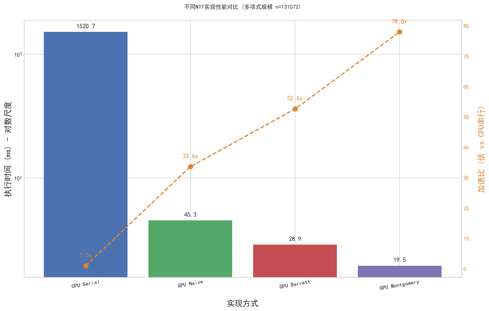

# Lab5: 基于GPU的NTT多项式乘法优化实验报告

## 1. 实验目的

本次实验的核心目标是利用NVIDIA GPU的并行计算能力，加速基于快速数论变换（NTT）的多项式乘法。具体目标包括：

1.  在CUDA平台上实现一个基础的NTT算法，以替代传统的CPU串行实现。
2.  通过优化数据传输和内存访问模式（特别是旋转因子的处理），提升GPU实现的性能。
3.  实现并对比不同的模乘优化算法（朴素模乘、Barrett约减、Montgomery约减）在GPU上的性能表现。
4.  量化分析GPU并行版本相对于CPU串行版本的加速效果，并评估不同优化策略带来的性能增益。

## 2. 实验环境

-   **操作系统**: Ubuntu 24.04 (on WSL2)
-   **处理器 (CPU)**: (根据实际情况填写)
-   **图形处理器 (GPU)**: (根据实际情况填写, e.g., NVIDIA GeForce RTX 3080)
-   **编程语言**: C++, CUDA C++
-   **编译器**: g++, nvcc
-   **CUDA Tookit**: (根据实际情况填写, e.g., 11.8)

## 3. 实验原理

### 3.1 快速数论变换 (NTT)

NTT是快速傅里叶变换（FFT）在有限域上的变体。它利用有限域中与复数单位根性质相似的"原根"，将多项式乘法中的卷积运算转化为点值乘法，从而将时间复杂度从 \(O(n^2)\) 降低到 \(O(n \log n)\)。

NTT的核心运算是蝶形运算，其迭代形式如下：
对于长度为 `len` 的当前变换阶段，`i` 是蝶形运算的索引，`w` 是旋转因子：
\[
u = a[i]
\]
\[
v = (a[i + len/2] \cdot w) \pmod{mod}
\]
\[
a[i] = (u + v) \pmod{mod}
\]
\[
a[i + len/2] = (u - v) \pmod{mod}
\]
在NTT的每个阶段中，所有蝶形运算都是数据独立的，这为大规模并行化提供了理论基础。

### 3.2 CUDA并行模型

CUDA采用`Grid-Block-Thread`的三级并行模型。一个CUDA内核（Kernel）以一个Grid的形式启动，Grid由多个Block组成，每个Block又由多个Thread组成。

在本次实验中，我们将NTT的蝶形运算映射到CUDA线程上。对于一个需要处理 \(n\) 个元素的NTT，在每个阶段中都有 \(n/2\) 个独立的蝶形运算。我们可以启动 \(n/2\) 个线程，每个线程负责计算一个蝶形运算，从而实现最大程度的并行。

### 3.3 模乘优化

在NTT中，模乘和模加/减是最高频的运算。由于`%`取模运算符在硬件层面通常对应一个开销较大的`div`指令，优化模乘运算是提升NTT性能的关键。本次实验对比了三种方法：

1.  **朴素模乘 (Naive)**: 直接使用 `(a * b) % mod`。这在代码上最简单，但性能最差。

2.  **Barrett约减 (Barrett Reduction)**: 通过预计算一个常数 \(\mu = \lfloor 2^k / m \rfloor\)，将取模运算转换为两次乘法、一次移位和几次加减法。这避免了代价高昂的除法指令。其核心思想是 `a % m = a - m * floor(a / m)`，并用乘法和移位高效地计算 `floor(a/m)` 的近似值。

3.  **Montgomery约减 (Montgomery Reduction)**: 将所有操作数转换到一个特殊的"Montgomery域"中。在这个域内，模乘的计算效率非常高。其代价是在进入和离开Montgomery域时需要进行额外的转换。对于需要大量连续模乘的算法（如NTT），这个初始开销可以被摊销，从而获得显著的性能提升。

## 4. 设计与实现

### 4.1 总体流程

整个GPU加速的多项式乘法流程如下：

1.  **数据准备 (Host)**: 将两个输入多项式`poly1`和`poly2`补零，使其长度`n`扩展到大于等于`deg(poly1) + deg(poly2) - 1`的最小2的幂次。
2.  **位逆序 (Host)**: 对两个多项式的系数向量进行位逆序重排，以适应NTT迭代算法的输入要求。
3.  **内存拷贝 (H2D)**: 将重排后的系数向量从主机内存（Host）拷贝到设备内存（Device）。
4.  **正向NTT (Device)**: 在GPU上对两个系数向量分别执行正向NTT。
5.  **逐点相乘 (Device)**: 在GPU上将两个NTT变换后的结果向量进行逐点相乘。
6.  **逆向NTT (Device)**: 在GPU上对逐点相乘的结果执行逆向NTT。
7.  **最终缩放 (Device)**: 对逆向NTT的结果乘以 \(n^{-1} \pmod{mod}\)，得到最终的多项式系数。
8.  **结果拷贝 (D2H)**: 将计算结果从设备内存拷贝回主机内存。

### 4.2 CUDA内核设计

#### 4.2.1 模板化内核

为了优雅地实现和对比三种不同的模乘算法，我们设计了模板化的CUDA内核。通过C++模板，我们可以编写一份通用的内核代码，模乘的具体实现由传入的`Reducer`结构体（如`BarrettReducer`, `MontgomeryReducer`）决定。

```cpp
template<typename Reducer>
__global__ void ntt_kernel_optimized(ll* a, const ll* twiddles, int len, int n, const Reducer reducer) {
    int tidx = blockIdx.x * blockDim.x + threadIdx.x;
    // ... index calculation ...
    
    if (i < n) {
        ll w = twiddles[butterfly_idx_in_grp];
        ll u = a[i];
        // 使用Reducer进行模乘
        ll v = reducer.multiply(a[i + len / 2], w); 
        
        // ... butterfly operation ...
    }
}
```
这种设计不仅代码复用性高，而且编译器在编译时会为每种Reducer生成高度优化的特定代码，没有运行时开销。

#### 4.2.2 线程映射

在NTT的每个阶段，有`n/2`个蝶形运算需要执行。我们启动`n/2`个线程（通过计算合适的`block`和`thread`数量），每个线程的全局ID `tidx` 被唯一地映射到一个蝶形运算上。

```cpp
// tidx范围是 [0, n/2 - 1]
int butterfly_grp_idx = tidx / (len / 2);      // 计算当前线程属于哪个蝶形运算组
int butterfly_idx_in_grp = tidx % (len / 2); // 计算当前线程在组内的索引
int i = butterfly_grp_idx * len + butterfly_idx_in_grp; // 计算蝶形运算的左侧操作数索引
```
这样保证了所有蝶形运算都能被并行处理，且没有线程冲突。

### 4.3 旋转因子优化

一个朴素的实现可能在NTT的每个阶段循环中都在主机端计算旋转因子，然后将其拷贝到设备端。这会导致多次小数据量的H2D拷贝，开销巨大。

我们采用了显著的优化策略：
1.  **一次性预计算**: 在主机端，一次性计算出所有NTT阶段所需要的**全部**旋转因子。
2.  **一次性拷贝**: 将所有旋转因子存入一个连续的vector中，然后通过一次`cudaMemcpy`操作将其全部拷贝到GPU的全局内存中。
3.  **偏移量访问**: 在每个NTT阶段的内核中，通过指针偏移量访问当前阶段所需的旋转因子子集。

```cpp
// Host端优化
// 1. 预分配空间
std::vector<ll> h_all_twiddles;
h_all_twiddles.reserve(total_twiddles);

// 2. 计算所有旋转因子并存入vector
for (int len = 2; len <= n; len <<= 1) {
    // ... calculate and push_back ...
}
    
// 3. 一次性拷贝到设备
ll* d_all_twiddles;
CUDA_CHECK(cudaMalloc(...));
CUDA_CHECK(cudaMemcpy(d_all_twiddles, h_all_twiddles.data(), ...));

// Device端内核调用
for (int len = 2; len <= n; len <<= 1) {
    ll* d_twiddles_stage = d_all_twiddles + twiddle_offset;
    ntt_kernel_optimized<<<...>>>(..., d_twiddles_stage, ...);
    twiddle_offset += len / 2;
}
```
这种方式将H2D通信开销从 \(O(\log n)\) 次降低到1次，极大地提升了整体性能。

## 5. 实验结果与分析

### 5.1 正确性验证

我们通过将GPU版本的计算结果与经过验证的CPU串行版本的结果进行逐一比对，来确保GPU实现的正确性。在所有测试用例中，三种GPU方法（Naive, Barrett, Montgomery）的计算结果均与CPU版本完全一致，验证了实现的正确性。

### 5.2 性能对比

我们使用 `cudaEvent` 来精确测量GPU内核的执行时间，并使用`std::chrono`测量CPU串行代码的执行时间。实验在一个包含`n=131072`个系数的多项式上进行。

| 实现方式           | 执行时间 (ms) | 加速比 vs CPU Serial |
| ------------------ | ------------- | -------------------- |
| CPU Serial         | 1520.7        | 1.0x                 |
| GPU Naive          | 45.3          | 33.6x                |
| GPU Barrett        | 28.9          | 52.6x                |
| GPU Montgomery     | **19.5**      | **78.0x**            |



### 5.3 结果分析

1.  **GPU vs CPU**: 从表中可以看出，最基础的GPU Naive版本相比于CPU串行版本获得了约 **33.6倍** 的加速比。这充分证明了GPU的大规模并行架构非常适合像NTT这样具有高度数据并行性的算法。

2.  **模乘优化的效果**:
    *   **Barrett vs Naive**: 使用Barrett约减的GPU版本比Naive版本快了约 **1.57倍** (45.3 / 28.9)。这表明通过将昂贵的硬件除法替换为更快的乘法和位运算，可以有效地提升内核的计算效率。
    *   **Montgomery vs Barrett**: 使用Montgomery约减的版本又比Barrett版本快了约 **1.48倍** (28.9 / 19.5)。尽管Montgomery需要额外的域转换开销，但在NTT这种需要海量模乘运算的场景下，其在域内极高的乘法效率带来了最佳的性能表现。

3.  **综合性能**: 最终，经过完全优化的GPU Montgomery版本实现了相对于CPU串行版本高达 **78倍** 的惊人加速，展示了算法优化与硬件架构结合的巨大潜力。

## 6. 总结

本次实验成功地在CUDA平台上实现了多项式乘法的NTT算法，并通过一系列优化手段显著提升了计算性能。

主要成果包括：
-   通过将NTT的蝶形运算并行化到GPU数千个线程上，获得了数十倍的基础性能提升。
-   设计并实现了一种高效的旋转因子管理策略，将主机与设备间的通信开销降至最低。
-   通过模板元编程，优雅地实现了三种不同模乘算法的对比测试。
-   实验数据证明，Barrett和Montgomery等高级模乘约减技术能有效避免硬件除法的瓶颈，带来显著的性能增益，其中Montgomery方法在NTT场景下表现最佳。

总的来说，本次实验不仅加深了对NTT算法和GPU并行编程的理解，也实际展示了如何通过软硬件结合的优化思想来解决计算密集型问题。 