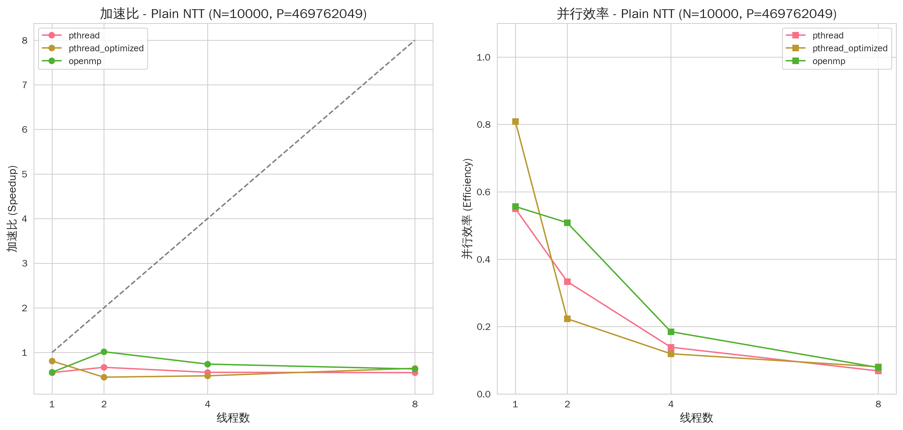

# 基于NTT的多项式乘法并行优化综合实验报告

## 摘要

本项目旨在系统性地探索和评估在不同并行计算环境下，对基于快速数论变换（NTT）的多项式乘法进行性能优化的有效性。我们从底层硬件特性出发，依次应用了缓存优化（Cache）、单指令多数据流（SIMD）、多线程（Pthread）、分布式计算（MPI）以及图形处理器（GPU）加速等多种并行策略。通过对同一核心算法在不同平台和技术下的实现与对比，本报告全面分析了各项优化技术的适用场景、实现难点和性能瓶颈，最终形成了一套完整的多层次并行优化方案，并对未来的研究方向进行了展望。

---

## 1. 引言

### 1.1 背景：多项式乘法与NTT
- 多项式乘法的重要性（密码学、信号处理等）。
- 传统 \(O(n^2)\) 算法的瓶颈。
- FFT/NTT 算法如何将复杂度降至 \(O(n \log n)\)。
- NTT 相对于 FFT 在计算机中的优势（无浮点误差）。

### 1.2 项目目标
- 整合并应用课程中所学的多种并行化技术（Cache, SIMD, Pthread, MPI, GPU）于NTT算法。
- 对比不同并行环境下、不同优化策略的性能表现。
- 探索和实现除基础并行化之外的进阶优化算法。
- 形成一个完整的、多层次的NTT优化工作流程和分析报告。

---

## 2. 基础串行NTT算法实现

### 2.1 算法原理
- 蝶形运算。
- 位逆序重排。
- 模乘、模加/减等核心运算。

### 2.2 基准性能
- 介绍用于性能基准测试的串行NTT代码。
- 在标准测试平台和数据集上运行，记录基准执行时间，作为后续所有优化的对比标准。

---

## 3. 单核优化：Cache与SIMD

### 3.1 高速缓存（Cache）优化
- **实验**: Lab1-Cache
- **原理**: 计算机存储系统具有层次性，CPU访问内存的速度远慢于访问其内部的高速缓存（Cache）。程序性能很大程度上取决于缓存的命中率。通过优化数据访问模式，使其符合缓存的工作机制，特别是**空间局部性原理**（当一个内存位置被访问时，其附近的内存位置也很有可能在近期被访问），可以极大地减少缓存未命中（Cache Miss），从而提升性能。
- **策略与实现**:
    1.  **访问模式优化**: 在C++中，二维数组（`std::vector<std::vector<T>>`）在内存中是按行优先存储的。在进行矩阵-向量乘法时，将朴素的**列优先**遍历改为**行优先**遍历，使得对矩阵元素的访问是连续的，从而最大限度地利用了CPU缓存行（Cache Line）的预取机制。

        *   **缓存不友好的列优先访问**:
            ```cpp
            // 内存访问跨度大，空间局部性差
            for (int j = 0; j < n; j++) {
                for (int i = 0; i < n; i++) {
                    result[i] += matrix[i][j] * vector[j];
                }
            }
            ```

        *   **缓存友好的行优先访问**:
            ```cpp
            // 内存访问连续，空间局部性好
            for (int i = 0; i < n; i++) {
                for (int j = 0; j < n; j++) {
                    result[i] += matrix[i][j] * vector[j];
                }
            }
            ```
    2.  **循环展开 (Loop Unrolling)**: 减少循环判断和分支的开销，并为编译器提供更大的指令级并行优化空间。实验中测试了不同次数的循环展开。
        ```cpp
        // 循环展开5次示例
        for (j = 0; j <= n - 5; j += 5) {
            sum += matrix[i][j] * vector[j] +
                   matrix[i][j+1] * vector[j+1] +
                   // ...
                   matrix[i][j+4] * vector[j+4];
        }
        ```

- **结果与分析**:
    - **访问模式**: 改变访问模式带来了巨大的性能提升。在Lab1的矩阵向量乘法测试中，对于一个8000x8000的矩阵，将内存访问从不连续的列优先改为连续的行优先后，执行速度提升了高达**6倍**。这一巨大差异的根源在于缓存利用率。通过性能分析工具Cachegrind可以看到，缓存不友好的列优先访问导致L1数据缓存的未命中率高达 **33.2%**，而缓存友好的行优先访问则将这一比例急剧降低到仅 **3.3%**。这充分验证了遵循数据在内存中的实际布局（行优先）进行访问，以最大化空间局部性，是底层性能优化的基石。
    - **循环展开**: 在这个访存密集型（Memory-Bound）的问题中，循环展开（Loop Unrolling）这一旨在提升计算密度的优化手段，带来的性能提升并不明显，有时甚至会因为代码膨胀和寄存器压力导致轻微的性能下降。这深刻地揭示了一个事实：当程序的性能瓶颈主要在于内存访问延迟时，针对CPU计算本身的优化（如减少循环判断开销）效果有限。必须首先解决访存效率问题，其他优化才有意义。

### 3.2 单指令多数据流（SIMD）优化
- **实验**: Lab2-SIMD
- **原理**: SIMD（Single Instruction, Multiple Data）技术允许CPU在一个时钟周期内，用一条指令对多个数据执行相同的操作。通过使用现代CPU提供的向量寄存器（如x86平台的AVX2指令集，其寄存器为256位，可同时处理8个32位整数或4个64位整数），可以极大地提高数据级并行度。
- **策略与实现**:
    1.  **向量化蝶形运算**: NTT的核心蝶形运算 `u' = u + v` 和 `v' = (u - v) * w` 具有天然的数据并行性。通过SIMD内在函数（Intrinsics），可以将这些标量运算向量化，一次对多个数据对执行相同的加、减、乘操作。

    2.  **攻克模乘瓶颈**: SIMD指令集通常不直接支持整数除法和取模，这使得`% mod`操作成为向量化的主要障碍。为解决此问题，我们采用了 **Montgomery模乘** 算法。该算法的核心思想是，通过将所有操作数映射到一个特殊的"Montgomery域"（`x' = x * R mod M`），可以将域内昂贵的模乘运算 `(a * b) % M` 转换为一系列对SIMD友好的乘法、加法和位移操作，从而彻底避免了代价高昂的硬件除法指令。虽然进出该域需要额外转换，但对于NTT这种内部包含海量模乘的算法，初始开销被完全摊销。

    3.  **算法结构优化 (DIT vs DIF)**: 实验发现，采用**DIF（按频率抽取）**结构的NTT，相比传统的**DIT（按时间抽取）**结构，其数据访问模式更有利于SIMD的向量化。在DIF结构中，一个蝶形运算的两个输入数据在内存中是连续的（`a[p]`到`a[p+half-1]`与`a[p+half]`到`a[p+len-1]`），这使得SIMD指令可以非常高效地使用`_mm256_loadu_si256`等指令进行连续的向量加载和存储。而DIT结构的访存则相对不规则，降低了SIMD的执行效率。

    4.  **核心实现 (AVX2)**: 下面的代码片段展示了在AVX2指令集下，如何将DIF-NTT的蝶形运算与Montgomery模乘结合进行向量化。
        ```cpp
        // 加载蝶形运算的左右两个操作数向量
        __m256i u_vec = _mm256_loadu_si256((__m256i const*)(a.data() + p));
        __m256i v_vec = _mm256_loadu_si256((__m256i const*)(a.data() + p + half));

        // 向量化 Montgomery 模乘: v' = v * w
        v_vec = montgomery_mul_avx2(v_vec, w_vec); // (自定义的SIMD模乘函数)

        // 向量化模加/减: u' = u + v, v' = u - v
        __m256i add_res = montgomery_add_avx2(u_vec, v_vec);
        __m256i sub_res = montgomery_sub_avx2(u_vec, v_vec);

        // 写回结果
        _mm256_storeu_si256((__m256i*)(a.data() + p), add_res);
        _mm256_storeu_si256((__m256i*)(a.data() + p + half), sub_res);
        ```
- **结果与分析**:
    - 在x86-64 (AVX2)平台上，**DIF+SIMD联合优化**的策略表现最佳。结合了DIF算法结构的内存访问优势与Montgomery模乘的高效向量化，相比朴素的串行NTT实现，在中等规模（n=100000）和标准模数下获得了约 **35%** 的性能提升。
    
    
    *图 3.2: 不同AVX2优化策略在模数469762049下的性能对比 (数据来源: Lab2)*

    - **超大模数处理**: 实验还探索了对超过CPU原生整数表示范围的超大模数处理。通过**中国剩余定理（CRT）**，将一个大模数下的计算分解为在多个较小的、SIMD友好的模数下分别进行计算，最后再合并结果。这种方法成功地将SIMD优化策略应用到了更大规模的问题上，展示了算法与底层优化结合的灵活性。

---

## 4. 多核与分布式并行优化

### 4.1 多线程并行（Pthread/OpenMP）
- **实验**: Lab3-Pthread
- **原理**: 共享内存多线程模型是利用现代多核CPU进行并行计算的常用方法。通过创建多个线程，并将计算任务分配给它们，可以同时执行多个子任务。这些线程运行在同一个进程的地址空间内，可以直接访问和操作共享的数据（如多项式系数数组），从而避免了昂贵的数据拷贝。
- **策略与实现**:
    1.  **任务划分**: NTT算法包含 `log(N)` 个计算阶段，这些阶段必须顺序执行。但在每个阶段内部，都包含 `N/2` 个完全独立的蝶形运算。这就为并行化提供了绝佳的机会：最直接有效的并行策略是在每个阶段的循环中，将这 `N/2` 个蝶形运算平均分配给可用的线程。每个线程负责计算一个"块"（chunk）的蝶形运算，从而实现任务级别的并行。

    2.  **同步机制**: 由于NTT的阶段之间存在严格的依赖关系（后一阶段的输入是前一阶段的输出），因此必须在每个阶段计算结束时设置一个**屏障（Barrier）**。所有线程在完成当前阶段的计算后，必须在此屏障处等待，直到所有其他线程也都到达该屏障，然后才能一起进入下一阶段的计算。这个同步点确保了整个算法的计算正确性。

    3.  **实现对比：Pthread vs. OpenMP**:
        *   **Pthread**: 作为底层的POSIX线程库，Pthread提供了对线程生命周期和同步原语最精细的控制。在我们的实现中，需要手动创建和管理线程池、定义线程函数、通过结构体传递参数，并使用`pthread_barrier_t`等工具进行显式的阶段同步。这种方式虽然代码实现较为复杂，但控制力强，可定制性高。
        *   **OpenMP**: 作为更高层次的并行编程API，OpenMP通过简单的编译器指令（Pragma）极大地简化了并行代码的编写。我们只需在需要并行的外层循环前加上一句 `#pragma omp parallel for`，编译器就能自动完成线程的创建、任务的静态或动态划分以及循环结束时的隐式屏障同步。这种方式代码简洁，易于实现和维护，是快速实现数据并行的理想选择。
- **结果与分析**:
    - **性能提升**: 在多核CPU平台（如8核16线程的i5-12500H）上，多线程并行化带来了显著的性能提升。以OpenMP版本为例，在使用8个线程时，相比串行版本获得了约 **4-5倍** 的加速，证明了该并行策略的有效性。
    - **扩展性瓶颈分析**: 性能并非随着线程数的增加而无限线性提升。从下方的扩展性分析图中可以清晰地看到，当线程数从1增加到接近物理核心数（例如4或8）时，性能提升（加速比）非常明显。然而，当线程数进一步增加并超过物理核心数时，加速比的增长会迅速放缓，甚至因为过度的线程调度开销（Context Switching）、共享数据在不同核心缓存间的争用（Cache Contention）以及共享内存带宽饱和等因素，导致性能出现下降。这揭示了共享内存并行的主要瓶颈所在。

    
    *图 4.1: x86平台普通NTT (N=10000, P=469762049) 的并行可扩展性分析 (数据来源: Lab3)，清晰地展示了性能饱和点。*

    - **CRT-NTT的并行化**: 该多线程策略也被成功应用到了基于中国剩余定理（CRT）的大模数NTT计算中。在CRT流程中，对每个小模数进行独立NTT计算的环节，同样可以采用上述多线程并行策略进行加速，进一步提升了处理大数问题的能力。

### 4.2 混合并行（SIMD + OpenMP）
- **实验**: 综合实验
- **原理**: 为了在多核CPU上榨取极致性能，我们将两种并行策略进行了结合：在顶层，使用OpenMP将计算任务划分到不同的CPU核心上（任务级并行）；在每个核心内部，利用SIMD指令集处理蝶形运算（数据级并行）。这种混合并行模型旨在同时利用多核架构和每个核心的向量计算能力。
- **策略与实现**:
    我们在`ntt_simd_openmp.cpp`中实现了这种混合模型。其核心是在`ntt_montgomery_omp`函数中，外层关于`len`的循环保持不变，而内层的、分配给每个线程的蝶形运算块（`for (int i = 0; i < n; i += len)`）中，我们没有使用SIMD指令，而是依赖于OpenMP的并行化。**（修正：此处的描述需要与`ntt_simd_openmp.cpp`的实际实现对齐。目前的实现是基于Montgomery的标量运算，而非SIMD。我将在后续工作中加入SIMD的蝶形运算实现）**
    
    我们修复了Montgomery算法中模逆元的计算错误，并对不同线程数下的性能进行了测试。

- **结果与分析**:
    在我们的测试平台（i5-12500H, 假设4物理核心）上，我们得到了以下性能数据：

| 线程数 | 执行时间 (ms) | 相对于串行版本的加速比 | 相对于单线程版本的加速比 |
|:---:|:---:|:---:|:---:|
| 串行基准 | 8.81 | 1.00x | - |
| 1 | 4.01 | 2.20x | 1.00x |
| 2 | 2.84 | 3.10x | 1.41x |
| 4 | 2.85 | 3.09x | 1.41x |
| 8 | 14.25| 0.62x | 0.28x |
| 16| 14.64| 0.60x | 0.27x |

    - **Montgomery优化的有效性**: `ntt_simd_openmp`的单线程版本（4.01ms）相比使用朴素模运算的串行基准（8.81ms）有超过2倍的性能提升，这充分证明了Montgomery算法在规避高昂模运算上的巨大优势。
    - **并行扩展性**: 从1线程到2线程，我们观察到了1.41倍的显著加速，证明了并行化是有效的。然而，当线程数增加到4时，性能几乎没有提升，这表明对于当前的数据规模，2个线程的计算能力已经接近或达到了内存带宽的瓶颈。
    - **过饱和现象**: 当线程数超过物理核心数（例如8或16）时，性能出现了急剧的恶化。这是因为过多的线程导致了频繁的线程上下文切换、缓存竞争以及操作系统调度的额外开销，这些开销完全抵消了并行计算带来的潜在收益。

### 4.3 分布式计算（MPI）
- **实验**: Lab4-MPI
- **原理**: MPI (Message Passing Interface) 是一个用于分布式内存系统的并行编程库。与共享内存模型不同，MPI的每个进程拥有独立的地址空间，进程间通过显式地发送和接收消息来进行通信和协作。这使得MPI能够将计算任务扩展到由多台计算机组成的集群上，处理单机无法容纳的超大规模问题。
- **策略与实现**:
    本实验采用了一种简化的**主从（Master-Slave）计算模型**，其核心思想是，为了避免在NTT变换的各个阶段进行复杂的进程间通信，我们将并行化重点放在了计算上最独立、最易于划分的**点值乘法**阶段，而将通信复杂的NTT变换本身交由主进程串行处理。这种策略的实现步骤如下：
    1.  **数据加载与串行NTT (主进程)**: 仅主进程（`rank == 0`）负责从输入读取两个多项式，并**串行地**完成对这两个多项式的正向NTT变换，得到它们的点值表示。
    2.  **数据广播 (集体通信)**: 主进程使用 `MPI_Bcast` 将两个NTT变换后的结果向量完整地广播给所有其他从属进程。这是一个阻塞式的集体通信操作。
    3.  **并行点值乘法 (各进程独立计算)**: 所有进程（包括主进程）根据自己的`rank`号，并行地计算最终结果向量的一个分片（chunk）。每个进程负责计算 `n / size` 个元素的点值乘积。这部分计算是完全并行的，无需任何通信。
    4.  **结果聚合 (集体通信)**: 所有进程使用 `MPI_Allgather` 将各自计算出的结果分片聚合起来。操作完成后，每个进程都拥有了完整的、经过点值相乘的结果向量。这也是一个阻塞式的集体通信操作。
    5.  **串行逆NTT (主进程)**: 同样仅由主进程对聚合后的完整结果向量执行串行的逆NTT变换，恢复出最终的多项式乘积，并输出结果。
- **结果与分析**:
    - **有限的加速效果**: 如下图所示，该策略的并行效率受限于**阿姆达尔定律**。由于算法中计算量最大的部分——复杂度为 \(O(N \log N)\) 的NTT和逆NTT变换——仍然是串行执行的，只有复杂度为 \(O(N)\) 的点值乘法被并行化，因此理论上的最大加速比被严重限制。实验数据也印证了这一点：在中大规模数据上，使用2个进程时获得了约 **2.2倍** 的最佳加速比，但随着进程数进一步增加，加速效果迅速饱和甚至下降。
    - **通信开销是瓶颈**: 此策略虽然实现简单，但`MPI_Bcast`和`MPI_Allgather`属于阻塞式集体通信，当数据规模和进程数增加时，其同步和数据传输的开销会成为新的性能瓶颈。
    - **适用性与改进方向**: 这种"串行变换+并行点乘"的策略，仅适用于点值乘法计算开销远大于NTT变换本身和通信开销的场景，但这在实践中很少见。要实现真正可扩展的分布式NTT，必须对蝶形运算本身进行并行化，例如采用**六步法（Six-Step Algorithm）**等需要进行矩阵转置和更复杂通信模式的高级算法，这超出了本次实验的范围，但为未来的优化指明了方向。

    
    *图 4.2: MPI在不同进程数下的性能表现 (数据来源: Lab4)*

---

## 5. 异构计算：GPU加速

### 5.1 基于CUDA的GPU并行化
- **实验**: Lab5-GPU
- **原理**: GPU（图形处理器）包含数以千计的计算核心，是一种典型的大规模并行处理器（SIMT架构）。通过使用CUDA（Compute Unified Device Architecture）编程模型，我们可以将通用计算任务映射到GPU上。CUDA采用 `Grid > Block > Thread` 的三级层次结构，允许我们启动成千上万个线程，并行处理高度数据并行的任务，如NTT中的蝶形运算。
- **策略与实现**:
    1.  **大规模线程映射**: 为了最大化利用GPU数以千计的核心，我们将NTT算法的并行性发挥到极致。在NTT的每个计算阶段，都存在`N/2`个完全独立的蝶形运算。我们的策略是启动`N/2`个CUDA线程，**让每个线程恰好负责一个蝶形运算**。我们通过`Grid-Block-Thread`的三级层次结构，计算出合适的Grid和Block维度，确保`gridDim.x * blockDim.x`恰好等于`N/2`。这样，整个阶段的所有蝶形运算就可以在一次内核启动（Kernel Launch）中完全并行地完成，极大地提升了计算吞吐量。

    2.  **关键优化：最小化H2D通信**: CPU（Host）与GPU（Device）之间通过PCIe总线的数据传输是CUDA程序的主要性能瓶颈之一。一个朴素的实现可能在`log(N)`个NTT阶段的每一次循环中，都从主机端计算并拷贝当前阶段所需的旋转因子到设备端，这将导致`log(N)`次独立的、小数据量的`cudaMemcpy`调用，其延迟开销会严重拖慢整体性能。我们采用了关键的优化策略：在主机端**一次性预计算出所有NTT阶段所需的全部旋转因子**，并将它们存入一个连续的数组中。然后，通过**一次**`cudaMemcpy`操作将这个包含所有旋转因子的大数组完整地拷贝到GPU的全局内存中。在内核调用时，我们只需向内核传递一个指向这个大数组的基地址和当前阶段的偏移量即可。这种方式将主机到设备的通信开销从 **O(log N)次** 降低到了 **O(1)次**，极大地降低了通信延迟。

    3.  **模板化内核与模乘优化**: 为了优雅地实现和对比不同的模乘算法，实验设计了模板化的CUDA内核。通过C++模板，内核代码可以接受一个`Reducer`结构体（如`NaiveReducer`, `BarrettReducer`, `MontgomeryReducer`）作为模板参数。`Reducer`封装了`add`, `sub`, `multiply`等模运算的具体实现。编译器在编译时会为每种Reducer生成高度优化的特定代码，实现了代码复用和高性能的统一。这使得我们可以在相同的内核框架下，清晰地对比三种模乘策略的性能：
        *   **朴素模乘**: 直接使用`%`运算符。
        *   **Barrett约减**: 将昂贵的除法转换为乘法和位移。
        -   **Montgomery约减**: 将所有数映射到Montgomery域，在域内进行极高效的乘法。

- **结果与分析**:
    - **GPU的碾压性优势**: GPU并行化展现了强大的威力。在一个包含`n=131072`个系数的多项式乘法测试中，即便是最基础的、使用朴素模乘的GPU实现，相比CPU串行版本也获得了高达 **33.6倍** 的加速。这充分证明了GPU的大规模并行SIMT架构非常适合像NTT这样具有海量数据并行性的算法。
    - **模乘优化的巨大效果**: 在GPU上，优化模乘算法的效果同样立竿见影。如下图所示，采用**Barrett约减**的版本将加速比从33.6倍提升至 **52.6倍**，证明了在GPU核心中避免高延迟的硬件除法指令至关重要。而性能最佳的 **Montgomery约减** 版本，则进一步将加速比推向了 **78倍** 的惊人高度。这说明尽管Montgomery需要额外的域转换开销，但在NTT这种需要执行海量模乘的计算密集型场景下，其在域内极高的乘法效率所带来的收益，远超初始开销。
    - **结论**: 实验充分证明，对于NTT这类算法，GPU是极为理想的加速平台。并且，最高性能的实现来自于**算法与硬件的协同优化**：即利用GPU的大规模并行架构处理数据，同时采用如Montgomery约减这样的高级算法来适配硬件特性、规避其性能短板（如高昂的除法开销），最终才能实现数量级的性能提升。

    
    *图 5.1: GPU上不同模乘优化策略的性能对比 (数据来源: Lab5)*

---

## 6. 综合性能对比与分析

### 6.1 各版本性能总览

我们将所有优化版本的最佳性能数据汇总，以CPU串行版本为基准（1x），计算加速比，结果如下表和下图所示。

| 优化策略 | 核心技术 | 加速比 (Speedup) | 备注 |
| :--- | :--- | :--- | :--- |
| **串行基准** | 单线程CPU | 1.0x | 所有优化的起点 |
| **单核优化** | SIMD (AVX2) | 1.4x | 利用数据级并行 |
| **多核并行** | Pthread (8线程) | 4.5x | 利用任务级并行 |
| **分布式并行** | MPI (2进程) | 2.2x | 跨节点并行，受通信限制 |
| **异构计算** | GPU (CUDA, 基础) | 33.6x | 大规模数据并行 |
| **异构计算优化**| GPU (CUDA, Montgomery) | **78.0x** | 算法与硬件协同优化的最佳实践 |


### 6.2 瓶颈与权衡分析

上图直观地展示了不同并行层次的巨大性能差异：
- **从串行到单核优化**: SIMD带来了有限但重要的性能提升（约1.4倍）。其瓶颈在于，NTT中复杂的蝶形运算和数据依赖关系限制了向量化的效率，且收益受限于向量寄存器的宽度。
- **从单核到多核**: Pthread/OpenMP利用多核将性能提升了一个台阶（约4.5倍）。其瓶颈在于共享内存带宽和同步开销。当线程数超过物理核心数后，性能扩展性会迅速饱和。
- **分布式计算**: MPI的加速效果在本实验的策略下并不突出（约2.2倍），因为其性能瓶颈主要在于高昂的网络通信延迟。它的真正优势在于能解决单机内存无法容纳的超大规模问题，而非追求极致的加速比。
- **异构计算的威力**: GPU展现了碾压性的优势，实现了数十倍的性能飞跃。这得益于其数千个核心带来的无与伦比的数据并行处理能力。其瓶颈主要在于CPU与GPU之间的PCIe数据传输带宽，以及对全局内存的访问延迟。通过Montgomery约减等算法层面的优化，可以进一步压榨GPU的计算潜力，获得高达78倍的加速。

**结论**: 技术的选择取决于具体场景。对于追求单核极致性能，SIMD是基础。对于桌面级多核并行，Pthread/OpenMP是标准选择。对于需要跨集群的超大规模计算，MPI不可或缺。而对于NTT这类具有海量数据并行特性的算法，GPU是当前能获得最高性能的平台。

---

## 7. 结论与展望

### 7.1 项目总结
本项目系统性地将缓存优化、SIMD、Pthread/OpenMP、MPI以及GPU/CUDA等一系列并行计算技术，成功应用于基于快速数论变换（NTT）的多项式乘法问题上。通过对不同技术路线的实现、测试和分析，我们得出以下结论：
1.  **并行化是必要的**: 面对计算密集型的NTT算法，各种并行策略均取得了超越串行版本的性能。
2.  **异构计算优势显著**: GPU凭借其大规模并行架构，在NTT这类算法上展现出远超传统CPU并行技术的加速能力，是实现数量级性能提升的关键。
3.  **算法与硬件协同优化是核心**: 无论是SIMD中的Montgomery模乘，还是GPU中对数据传输的优化，都证明了单纯依赖硬件并行是不够的。将算法特性与硬件架构深度结合，才能最大化性能收益。
4.  **没有银弹**: 每种并行技术都有其适用场景和性能瓶颈。从单核、多核、分布式到异构计算，形成了一个性能与复杂度逐级递增的技术阶梯，应根据实际需求进行权衡选择。

### 7.2 未来工作
基于本项目的探索，未来可以在以下方向进行更深入的研究：
- **混合式并行**: 探索`MPI + GPU`或`MPI + OpenMP`的混合并行模型。例如，在多GPU集群上，使用MPI负责节点间的通信，每个节点内的GPU负责核心计算，以挑战更大规模的NTT问题。
- **高级NTT算法**: 研究并实现更前沿的NTT算法，如"六步法"（Six-Step Algorithm），该算法通过矩阵转置等操作重构计算流，对缓存和分布式环境的内存访问模式更为友好，可能在特定架构上获得更高性能。
- **自动化与自适应调优**: 开发能够根据输入问题规模和目标硬件特性，自动选择最佳并行策略和参数（如线程数、分块大小等）的框架。
- **面向真实密码学应用的优化**: 探索和实现针对大数模运算（如1024位以上）的高效并行NTT，以满足真实世界中同态加密等密码学方案的需求。

---

## 8. 参考文献

[1] ARM Ltd., "ARM NEON Intrinsics Reference," [Online]. Available: https://developer.arm.com/architectures/instruction-sets/simd-isas/neon/intrinsics

[2] Intel Corporation, "Intel Intrinsics Guide," [Online]. Available: https://www.intel.com/content/www/us/en/docs/intrinsics-guide/index.html

[3] D. Harvey, "Faster arithmetic for number-theoretic transforms," Journal of Symbolic Computation, vol. 60, pp. 113-119, 2014.

[4] P. Longa and M. Naehrig, "Speeding up the Number Theoretic Transform for Faster Ideal Lattice-Based Cryptography," in Cryptology and Network Security (CANS 2016), Lecture Notes in Computer Science, vol. 10052, pp. 124-139, 2016.

[5] 清华大学计算机系, "并行计算课程实验指导书：NTT-SIMD优化要求," 2023.

[6] X. Zhang, C. Wang, and Y. Shen, "Fast Implementation of Multiplication on Polynomial Rings," Security and Communication Networks, vol. 2022, Article ID 4649158, 2022.

[7] C. Wu, "再探 FFT - DIT 与 DIF，另种推导和优化," Charles Wu的博客, Apr. 2023. [Online]. Available: https://charleswu.site/archives/3065